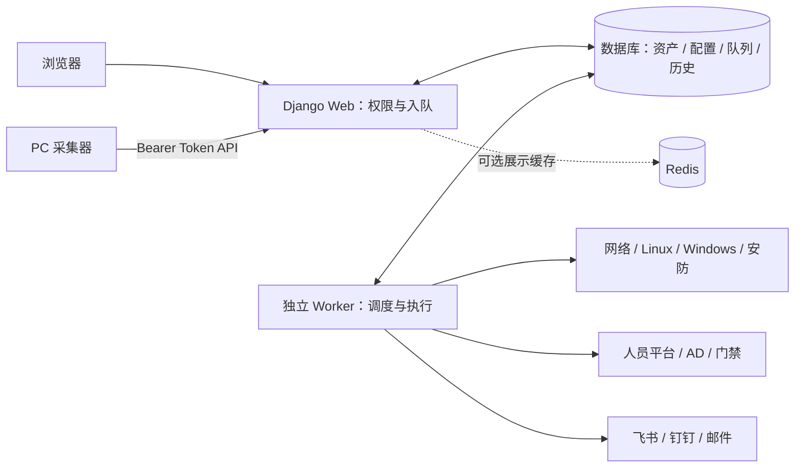

# 网络巡检中心（net） 0.9.1

基于 Django 的内网资产管理、设备巡检与 PC 日志分析系统。通过网页配置、手动任务和定时任务，完成数据采集、规则分析、历史查询及异常/恢复通知。

PC 日志由 Windows/macOS 采集器每两小时本地覆盖 `latest.json`，再以 Bearer Token 直传 Web API。Windows 服务器 HTTP 巡检是另一套独立功能。

## 文档导航

| 内容 | 文档 |
| --- | --- |
| Windows Server / Linux 安装、升级、启停 | [一键部署](deploy/README.md) |
| 任务数据流、数据库表与关系、并发约束 | [架构与数据库](docs/architecture.md) |
| PC 来源、EXE、域下发、人员匹配、磁盘与温度 | [PC 采集与分析](docs/pc-collection.md) |
| 网络/服务器/安防连接、模板继承、命令解析、门禁 | [设备巡检](docs/device-inspection.md) |
| 飞书/钉钉同步、域控管理、BitLocker | [人员与域控](docs/identity-management.md) |
| Windows 内部 CA 导出、导入及 636 排障 | [LDAPS 证书指南](docs/ldaps-ca.md) |
| 设备原始配置备份与恢复边界 | [配置备份](docs/device-configuration-backups.md) |
| 数据库/缓存、历史归档及代码维护 | [MariaDB/Redis](docs/mariadb-redis.md) · [维护命令](docs/backend-maintenance.md) · [代码目录](docs/project-layout.md) |

## 部署与启动

### 正式部署

先将代码放到固定目录，准备可连接的 MariaDB/MySQL 数据库及专用账号。Windows 安装 **64 位 Python 3.12+**；Linux 需要 systemd 和 root/sudo。以下命令在项目根目录运行。

Windows 管理员 PowerShell：

```powershell
powershell.exe -NoProfile -ExecutionPolicy Bypass -File .\deploy\windows\Install-NetInspection.ps1
```

Linux：

```bash
sudo bash deploy/linux/install.sh
```

首次引导填写访问地址、数据库连接，生成稳定密钥并创建管理员；随后迁移、收集静态文件并设置独立 Web/Worker 开机启动。Windows 使用两个计划任务，Linux 使用两个 systemd 服务。默认访问 `http://服务器IP:8000/`，以配置为准。

已有 `.env` 和数据原样复用，不写演示数据、不安装数据库实例、不自动修改防火墙。升级前备份，更新代码后重跑同一脚本；失败时服务保持停止，修复后再运行。旧部署需先按原方式停机，避免多套进程。

迁移机器时还要恢复数据库、原密钥和软件策略，不能只复制代码。Web/Worker 运行账号、HTTPS、日志和脚本参数见[完整部署步骤](deploy/README.md)。

### 本地演示

Windows：

```powershell
py -3.12 -m venv .venv
.\.venv\Scripts\python.exe -m pip install -r requirements.lock.txt
.\.venv\Scripts\python.exe -m deploy.demo --no-worker
```

Linux 将解释器换成 `python3.12` / `./.venv/bin/python`。已有虚拟环境时跳过创建。打开 `http://127.0.0.1:8000/`，Ctrl+C 停止启动器。

未配置数据库时使用 `demo-runtime/demo.sqlite3` 并初始化展示数据；已有 `.env` 指定 MySQL/MariaDB 时沿用该库，不灌展示数据。`--no-worker` 只展示页面；去掉它会启动 Worker 并执行新提交的真实任务。不要把演示初始化或重置命令用于生产排障。

### 配置来源

普通管理命令加载根目录 `.env`（或 `NET_ENV_FILE`），已有进程环境变量优先；新一键部署的 `deploy.setup` / `deploy.service` 则以选定的环境文件为准，防止终端残留数据库变量串库。

| 配置 | 用途 |
| --- | --- |
| `DB_ENGINE`、`DB_*` | 数据库类型与连接；SQLite 需注意 `DJANGO_SQLITE_PATH` 的实际位置 |
| `DJANGO_DEBUG`、`DJANGO_SECRET_KEY`、`DJANGO_ALLOWED_HOSTS` | 正式环境关闭调试，设置稳定签名密钥和允许访问的主机 |
| `PC_LOG_SOURCE_ENCRYPTION_KEY` | PC 来源凭据加密 |
| `DEVICE_BACKUP_ENCRYPTION_KEY` | 设备备份、门禁令牌等加密 |
| `DOMAIN_OPERATION_ENCRYPTION_KEY` | 域密码操作加密 |
| `DJANGO_STATIC_ROOT` | 静态文件收集目录 |
| `NET_PAGE_CACHE_ENABLED`、`NET_REDIS_URL` | 可选展示缓存，默认关闭 |

三个 Fernet 密钥各自独立，支持同名 `_FILE`；Web、Worker 必须共用同一组稳定密钥。密钥丢失不能通过生成新值解密旧数据。全部配置以 [settings.py](net/settings.py)、[环境加载代码](net/infrastructure/environment.py)和部署入口为准；默认时区为 `Asia/Shanghai`。

## 登录与权限

人员台账、AD 域账号、网站登录账号是三个独立对象，导入人员或同步域控不会自动创建网站账号。

| 身份 | 业务页面权限 |
| --- | --- |
| 未登录 | 汇总及基础列表；不提供联系方式、详细配置、日志证据、导出或下载 |
| 普通用户 | 获准的详情、查询和表格导出；不能添加、导入、配置、测试连接或执行任务 |
| 管理员 | 活跃的 `is_staff` 或 `is_superuser`；可执行管理操作，后端仍检查具体条件 |

在 `/admin/` → 用户中创建登录账号。普通用户不勾选职员/超级用户；勾选职员可获得业务管理权限。Django Admin 另按模型权限/权限组授权，加入一个名为“管理员”的组本身不会改变业务角色。

首次正式安装引导创建超级用户。后续在**实际使用的数据库环境**运行 `python manage.py createsuperuser`；忘记密码用 `python manage.py changepassword 用户名`。默认演示库需要先设置 `DB_ENGINE=sqlite` 和指向 `demo-runtime/demo.sqlite3` 的 `DJANGO_SQLITE_PATH`，否则管理命令可能访问根目录另一份库。

登录有效期在 [settings.py](net/settings.py) 中直接配置：`SESSION_COOKIE_AGE = 36000`，即 10 小时，没有后台设置页面。修改后重启 Web 并重新登录验证；只在 `.env` 添加同名变量不会生效，也不代表每次点击页面都会续满 10 小时。

## 功能与使用顺序

| 功能 | 操作入口与流程 |
| --- | --- |
| 人员台账 | 人员列表 → CSV/XLSX 导入，或飞书/钉钉 → 保存 → 测试 → 预览 → 导入 |
| PC 获取与分析 | 日志分析记录 → 保存终端 API 与分析/计划 → 下载并部署采集包；手动和定时任务从数据库为每台 PC 冻结最新日志后分析 |
| 设备资料 | 网络/服务器/安防列表 → 添加、导入或单行“修改配置”；硬件资料由有效采集结果补充 |
| 巡检方法与报警 | 设备列表 → 配置模板，按项目设采集方式、命令/OID、解析、阈值和等级；单行“巡检设置”覆盖差异 |
| 单台巡检 | 设备行 → 手动巡检；只创建该设备目标，切换配置不改变目标 |
| 批量与定时巡检 | 巡检配置 → 先选设备，再选适用项目 → 保存计划或执行 |
| 原始配置下载 | 设备列表勾选设备 → 下载；单台原文件、多台 ZIP；详情可查历史版本 |
| AD 管理 | 连接设置 → 测试/同步 → 域账号、计算机及所属分组；入组/移动 OU 从已同步目录选择，分组列表通过“成员管理”弹窗批量添加、移除成员；计算机行按需获取 BitLocker 密钥 |
| 门禁记录 | 安防导航 → 门禁记录 → 平台配置 → 保存并测试 → 按时段手动同步 |
| 任务通知 | 告警渠道 → 保存并测试 → 默认/项目策略；告警记录 → 模板配置 |

配置弹窗保存失败保留填写内容；手动输入项提供示例，纯选项不重复提示。网络、服务器和安防导入窗口有字段示例，模板含演示行，使用前替换或删除。同一 IP 更新已有设备，未提供的列保留原值；PC 来自日志，不提供设备清单导入。

表格支持全量筛选、排序、数据库分页和按相同筛选条件导出，不限于当前页。列偏好保存在当前浏览器。设备连接秘密不进入普通表格导出；原始配置下载仅管理员可用，保留设备返回的完整内容。

### 采集方式与模板

- **网络**：Netmiko SSH + SNMP。新设备默认优先 SNMP、缺项补充 SSH；项目显式指定协议时按该项目执行。华为 VRP、华三 Comware、锐捷 RGOS、思科 IOS/IOS XE 提供基础与类型模板，路由、ARP、MAC、LLDP、无线 AP/客户端等项目按类型适用。深信服 AC 上网行为管理使用独立 Open API 模板。
- **服务器**：不配置厂商，Linux 用 Paramiko SSH，Windows 用单独安装的 HTTP Agent。有效 CPU 型号/核数、内存和磁盘容量回填资产；使用率保存在巡检记录。
- **安防**：录像机、摄像头、门禁等自动模式先用 SNMP，再由厂商 API 补采缺项，最后回退 Ping；无接口时可只检查 Ping 在线，不能据此判断业务正常。
- **门禁平台**：V6600 尚需部署实例核实端点与认证，当前为 V6000 2.11 兼容格式；海康/大华平台仅为占位，不承诺可用。详见[兼容范围](docs/device-inspection.md#门禁平台记录)。

网络模板支持“厂商基础 → 设备类型 → 可选系统版本 → 本设备覆盖”。子模板默认继承，只展开修改差异；系统版本可手填或自动采集。未知版本回退类型模板，显式绑定则使用指定父链。版本匹配规则、命令解析示例及默认模板创建方法见[模板指南](docs/device-inspection.md#配置模板与继承)。

模板决定“怎么采集、怎么判定”，巡检配置决定“检查哪些设备、哪些项目”。每台执行所选与适用项目的交集，配置在入队时冻结，修改不重算历史任务。网络、服务器、安防将等级设置合并到项目中，PC 保留独立“问题等级设置”，软件分析可选择白名单或黑名单模式，无需修改策略文件。

### 结果与统计口径

资产台账与动态记录分开；首页按每台设备最新结果汇总，未执行过不能算正常。记录页围绕最新任务展示，PC 最新任务无结果时不回退混入旧任务；逐条 PC 结果在任务详情查看。

任务执行成功、设备业务正常、消息送达是不同状态。数据缺失保留提示/未知，不伪造正常值，也不充当恢复。故障率为异常目标数 /（正常 + 异常目标数），未完成与取消目标不计入分母。

PC 人员为主模式只分析匹配入队时在职名册的日志，离职人员排除，在职无日志人员计入缺失统计但不伪造分析记录；日志为主保留全部范围内日志，只有存在名册时才对未匹配人员提示。工号优先，姓名忽略首个半角 `-` 后说明；同名不猜测。磁盘容量与使用率分开，旧日志无剩余空间时不能计算使用率。完整边界见 [PC 指南](docs/pc-collection.md)。

## 架构与技术栈



Web 负责页面、后端授权、校验和短事务；Worker 在数据库领取任务，在事务外执行网络采集及耗时分析，再校验租约并保存结果。没有 Celery、RabbitMQ 或额外调度服务器，Redis 不承担任务队列。

| 开源库/组件 | 用途 |
| --- | --- |
| Python 3.12+、Django、Django REST framework | 应用运行、ORM/迁移/认证；DRF 仍用于部分测试，不是 PC 上传入口 |
| Waitress、WhiteNoise | WSGI Web 和正式环境静态文件 |
| mysqlclient、redis | MariaDB/MySQL 驱动、可选页面缓存 |
| python-dotenv、keyring、cryptography | 环境加载、系统凭据库、Fernet 加密 |
| Netmiko、Paramiko、PySNMP | 网络设备 SSH、Linux SSH、SNMP 只读采集 |
| TextFSM、ntc_templates | 命令回显解析及部分默认模板 |
| ldap3、PyCryptodome | AD 查询/操作及 NTLM 所需算法 |
| requests、aiohttp、dnspython | HTTP、DNS；PC 采集器使用 HTTPS/HTTP API 上报 |
| Bootstrap、原生 JavaScript/CSS | 服务端页面与弹窗，无需 npm 构建；Node 仅用于前端测试 |
| PowerShell、LibreHardwareMonitorLib、PawnIO | Windows 采集；温度依赖 CPU 传感器、权限及驱动，许可证随包提供 |

准确版本与兼容约束以 [requirements.txt](requirements.txt) 和 [requirements.lock.txt](requirements.lock.txt) 为准，安装使用锁文件，避免只升级某个协议库造成冲突。

业务目录：`index/` 为页面/表单，`net/devices/people/domain/access` 为业务服务，`net/inspections/alerts` 为执行和通知，`net/infrastructure/data_exchange` 为基础设施与导入导出，`net/models/migrations` 为模型及迁移，`agents/deploy` 为终端与部署工具。

数据库按资产、来源与模板、任务/目标、日志/巡检结果、异常与投递分层。常用查询采用关系字段和索引，异构回显与冻结规则用 JSON。表名、关系、去重约束及 MariaDB 索引说明见[数据库结构](docs/architecture.md#数据库模型与关系)，不要直接改 JSON 代替业务保存流程。

## 后台任务与通知

Worker 同时承担到期计划检查、任务领取、租约续期和告警处理。单 Worker 一次领取一个主任务，内部按线程/配置上限并发执行目标；没有 Worker 时网页可用，但后台任务不执行。

计划支持间隔分钟/小时、每日指定时间。恢复后只处理一次到期计划，不逐次补跑停机期间的全部时点。人员平台修改凭据、范围或启用状态后必须重新测试；成功同步本身不使测试失效。看“最近入队”和调度原因，不能仅凭“下次执行”判断已运行。

任务详情可查看逐目标进度、结果和原因。取消阻止未完成结果继续提交，已完成结果保留；外部请求可能等到返回/超时才结束，也不会撤销已经发生的域操作或文件移动。中断后普通任务可按租约和尝试上限恢复，一次性域密码任务不能盲目重放。

继承默认告警时，弹窗展示当前默认渠道；默认策略更新对新入队任务生效，已入队任务及其分析子任务沿用原渠道，不自动补发历史通知。

设备结果生成站内异常/恢复记录，整批结束后每渠道发送一条总结；持续异常可随下次巡检再次通知。PC 获取已有分析子任务时由分析任务总结，避免重复。通知失败不撤销巡检结果；人员同步和目录操作不参与设备告警。渠道测试会真实发送，模板预览只用示例数据。

## 维护与常见问题

升级顺序：备份数据库/配置/密钥/归档 → 停原服务 → 更新代码及锁定依赖 → 迁移、收集静态文件 → 从原入口启动 → 核对 Web、Worker 和最近任务。一键脚本覆盖安装准备及启停，备份仍需自行完成。终端采集器或 Windows HTTP Agent 更新需另行下载部署。

| 现象 | 检查与处理 |
| --- | --- |
| 网页正常，任务一直等待 | 查 Worker 状态及 Web/Worker 的代码、虚拟环境、数据库；不要重复起服务 |
| 飞书自动同步等待重新测试 | 保存后测试连接，查来源启用、计划、调度原因；旧版本升级后重新测试，不直接改测试时间 |
| 登录失败或数据不见 | 核对命令与服务是否指向同一个库，特别是根目录 SQLite、演示 SQLite 和 MariaDB |
| 关掉窗口仍能访问 | 浏览器关闭不停止服务；按计划任务/systemd/原启动器停止 Web 和 Worker |
| PC 没新日志 | 查终端任务、本地 latest.json、collector.log、终端到 endpoint_url 的连通性及令牌；手动分析不会远程催采 |
| PC 软件/温度缺失 | 查“采集诊断”；不完整软件清单不判必装缺失，温度不可用不以主板/GPU 数值替代 |
| PC API 上报失败 | 查 is_enabled、Bearer 令牌、Content-Type: application/json、16 MiB 限制和时间；重置令牌后重新下载部署采集包 |\n| PC 原始日志不可用 | 日志按独立策略清理；分析结果与普通 log_id 标识保留，详情只能按需读取尚未清理的原始日志 |
| 服务器 HTTP 500 / 服务数据不足 | 更新目标服务器 HTTP 脚本，查 `%ProgramData%\NetworkInspectionAgent` 日志和令牌；管理员身份不保证每个服务可读 |
| 网络 Ping 通但部分失败 | 按项目查 SNMP 视图/OID、SSH 命令/解析；在模板窗口用实际回显预览 |
| 深信服吞吐量 401 | 查 Worker 出口白名单、开放接口和共享密钥，确保 Worker 已更新；吞吐量使用 POST JSON 签名 |
| 配置下载为空或无法解密 | 先看备份支持范围/成功版本，再核对原备份密钥；下载不会即时连接设备 |
| 域控 636 / BitLocker 失败 | 按 [CA 指南](docs/ldaps-ca.md) 查 DNS、证书链、端口及目录权限；项目 BitLocker 读取要求 LDAPS |
| MariaDB W003 / W036 | 核对实际迁移和索引；目标范围有专用唯一索引，不截断 DN、不重置表，详见[数据库说明](docs/architecture.md) |
| 告警未收到 | 整批是否结束、目标处理是否完成，再查总结生成错误、渠道状态与投递详情 |
| 静态文件仍旧 | 确认运行代码、`collectstatic` 输出目录和浏览器缓存；更新 Python 后还需重启对应进程 |

只读检查（使用实际虚拟环境；Linux 换为 `./.venv/bin/python`）：

```powershell
.\.venv\Scripts\python.exe manage.py check
.\.venv\Scripts\python.exe manage.py showmigrations net
.\.venv\Scripts\python.exe manage.py makemigrations --check --dry-run
```

`run_task_worker --once` 会调度、执行及投递，**不是只读健康检查**。不要用重置演示数据、删除数据库/WAL 文件或批量结束 Python 进程排障。

按改动范围选测，以下为隔离 SQLite 的部署回归示例，结束后恢复终端变量：

```powershell
$previousEngine = $env:DB_ENGINE
try {
    $env:DB_ENGINE = 'sqlite'
    .\.venv\Scripts\python.exe manage.py test tests.architecture.test_one_click_deployment tests.architecture.test_deployment
} finally {
    $env:DB_ENGINE = $previousEngine
}
node --test tests/frontend/*.test.js
```

模拟协议与 SQLite 测试不能替代目标 MariaDB 并发、服务注册、真实设备/平台和共享权限验收。系统提供周期快照与规则判断，不等于实时监控或完整安全合规；SSH 主机身份校验、部分凭据存储等后续工作记录在[安全待办](docs/security-followups.txt)。
