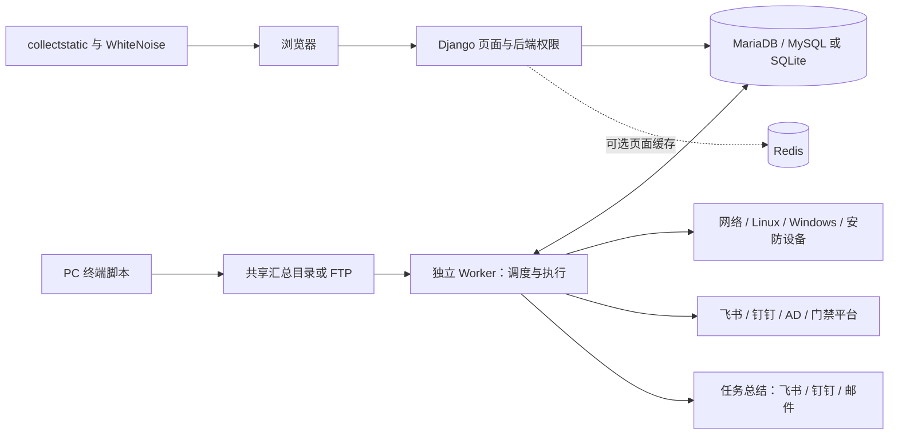
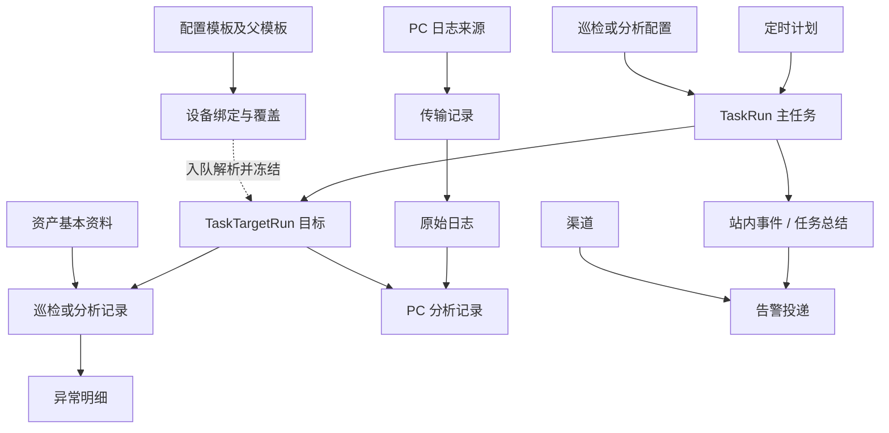

# 网络巡检中心（net）

基于 Django 的内网资产管理、设备巡检与 PC 日志分析系统。集中管理人员、PC、网络设备、服务器、安防设备和 Active Directory 目录，通过网页配置、手动任务和定时任务完成采集、分析、记录查询、数据导入导出及异常/恢复通知。

本项目的重点是“资产台账 + 周期性巡检 + 有历史证据的规则分析”，不是持续秒级采样的时序监控平台，也不是自动修复或 AI 分析系统。

> 当前 PC 流程：终端生成 JSON → 写入统一共享汇总目录 → Worker 通过 SMB 或 FTP/FTPS 获取 → 入库归档 → 分析。PC 不再直接上传到 Web API；Windows 服务器的 HTTP 巡检服务是另一套独立功能。

## 目录

- [1. 功能概览](#1-功能概览)
- [2. 技术栈与第三方库](#2-技术栈与第三方库)
- [3. 整体架构与数据库结构](#3-整体架构与数据库结构)
  - [运行架构](#31-运行架构)
  - [数据流与事务边界](#32-数据流与事务边界)
  - [数据库模型与关系](#33-数据库模型与关系)
- [4. 快速启动与管理员账号](#4-快速启动与管理员账号)
- [5. 正式部署与环境配置](#5-正式部署与环境配置)
- [6. 页面和数据操作](#6-页面和数据操作)
- [7. PC 共享日志获取与分析](#7-pc-共享日志获取与分析)
- [8. 网络设备、服务器和安防巡检](#8-网络设备服务器和安防巡检)
- [9. 人员 API 同步与域控管理](#9-人员-api-同步与域控管理)
- [10. 后台任务、定时和告警逻辑](#10-后台任务定时和告警逻辑)
- [11. 代码目录与扩展方式](#11-代码目录与扩展方式)
- [12. 日常维护、验证与排障](#12-日常维护验证与排障)
- [13. 统计口径与已知边界](#13-统计口径与已知边界)

## 1. 功能概览

| 模块 | 主要能力 | 数据来源 |
| --- | --- | --- |
| 首页 | 分类资产统计、正常/异常状态、上次执行时间、最近任务及详情入口 | 本地资产及任务结果 |
| 人员 | 列表、个人详情、在职/离职统计、平均在职年限、入离职日期、导入导出 | CSV/XLSX、飞书、钉钉 |
| PC | 配置台账、日志证据、规则分析、每日去重、Windows/macOS 采集脚本下载 | 统一共享目录中的 JSON |
| 网络设备 | SSH/SNMP 采集、指标和接口/VLAN 信息、日志、每日原始配置备份（最近 10 份） | 设备管理接口 |
| 服务器 | Linux SSH 巡检、Windows HTTP JSON 巡检、硬件与系统信息 | SSH 或项目提供的 Windows 服务 |
| 安防设备 | 摄像头、录像机、门禁等台账；设备/通道/存储状态；支持范围内的配置导出 | 厂商 HTTP API、SNMP 或 Ping |
| 门禁记录 | 平台配置、连接测试、按时间段同步事件、记录筛选及导出；平台兼容范围见第 8.6 节 | 门禁管理平台北向 API |
| 配置模板 | 按厂商/类型继承，每项目配置采集方式、命令/OID、解析、阈值和等级；单设备覆盖 | 数据库模板和设备绑定 |
| 域控管理 | 域账号、域计算机、域分组同步及详情；账号/计算机批量操作 | LDAP/LDAPS |
| 后台任务 | 入队、目标明细、进度、租约恢复、手动结束、多线程执行 | 数据库任务队列 |
| 定时计划 | 每隔 N 分钟/小时、每天指定时间；项目与目标选择 | 页面保存的配置 |
| 告警 | 飞书、钉钉、邮件；站内异常/恢复记录、每任务统一总结、投递记录和重试 | 已持久化的巡检/分析结果 |
| 表格工具 | 筛选、可输入下拉选项、排序、自定义列、每页数量、筛选结果导出 | 统一表格定义 |
| 管理后台 | 基础数据维护、配置管理、任务和历史记录查询 | Django Admin |

设备原始配置备份、历史下载、支持范围与密钥部署见 [配置备份说明](docs/device-configuration-backups.md)。

配置、添加与导入弹窗使用局部交互：保存、测试和执行仍为带 CSRF 的 POST，但不再整页跳转；渠道类型、巡检/PC 配置和批量分析范围通过局部读取切换。成功与校验失败在当前弹窗显示，后台任务提供详情入口。PC 来源与分析配置分别保存时保留另一份未保存的表单。渠道/配置切换草稿只保存在当前窗口内存中，关闭弹窗后清除缓存；批次预览始终重新读取，不复用旧数量。普通下载和页面导航不受影响。

人员、域账号和 Django 登录账号是三类不同对象：

- **人员**是业务台账，以工号识别。
- **域账号**是从 Active Directory 同步的目录对象。
- **Django 用户**用于登录管理后台和执行获授权操作。人员导入、域同步不会自动创建 Django 管理员。

## 2. 技术栈与第三方库

以下版本来自仓库依赖声明、锁文件或内置静态文件，不代表对上游“最新版本”的实时查询；升级环境以锁文件为准。完整依赖见 [requirements.lock.txt](requirements.lock.txt)，直接依赖见 [requirements.txt](requirements.txt)。

| 库 / 组件 | 当前版本 | 在本项目中的作用 |
| --- | --- | --- |
| Python | 最低 3.12 | Web、业务逻辑、Worker；启动时检查最低版本 |
| Django | 6.1.1 | 路由、模板、表单校验、ORM、事务、迁移、认证、权限、Admin |
| Django REST framework | 3.18.0 | 依赖仍保留，现有测试使用 APIClient；不是新版 PC 日志入口 |
| ldap3 | 2.9.1 | 域控连接、查询、目录同步和获授权的 AD 写操作 |
| pycryptodome | 3.23.0 | 为 ldap3 的 NTLM 认证提供 MD4 算法（现代 OpenSSL 通常不提供） |
| cryptography | 50.0.1 | PC 来源、域密码任务、原始设备备份及门禁平台令牌的 Fernet 加密 |
| mysqlclient | 2.2.8 | Django 的 MySQL 数据库驱动 |
| redis | 8.1.0 | Redis 页面短时缓存客户端 |
| python-dotenv | 1.2.3 | Web、Worker 与管理命令统一加载根目录 `.env` |
| keyring | 25.7.0 | 从操作系统凭据管理器读取专用数据库账号密码 |
| requests | 2.34.2 | 人员平台、通用设备 HTTP 采集及部分消息投递 |
| aiohttp | 3.14.3 | 原生安防配置传输中的异步 HTTP，并非所有请求都使用它 |
| dnspython | 2.8.0 | 原生 HTTP 传输的 DNS 解析 |
| paramiko | 4.0.0 | Linux SSH 连接与命令执行，也是 Netmiko 的底层 SSH 库 |
| netmiko | 4.7.0 | 网络设备 SSH 厂商适配、会话准备和命令执行 |
| pysnmp | 7.1.29 | SNMPv2c/v3 GET、BULK WALK 等只读采集 |
| smbprotocol | 1.17.0 | 通过其 smbclient 接口访问 SMB 共享目录 |
| waitress | 3.0.2 | Windows/Linux 通用 WSGI Web 服务 |
| whitenoise | 6.12.0 | DEBUG=False 时提供 collectstatic 生成的静态资源 |
| TextFSM | 2.1.0（锁文件） | 将网络设备命令回显解析为字段和记录 |
| ntc_templates | 9.2.0（锁文件） | 默认网络模板使用的部分 TextFSM 规则；创建时将解析文本保存到数据库 |
| Bootstrap | 5.3.8（仓库内置） | 响应式布局、弹窗、表单和基础组件 |

网络设备采用 Netmiko 4.7.0；其官方依赖要求 Paramiko `>=3.5,<5`，因此锁定兼容的 4.0.0，不能与 Paramiko 5.0.0 强制混装。Linux 继续使用原有 Paramiko `exec_command()` 流程。升级时先停止现有 Web/Worker，在原虚拟环境执行 `python -m pip install -r requirements.lock.txt`，再按原部署方式启动；此项改动无需数据库迁移。

另外使用 Python 标准库：

- concurrent.futures、threading：有上限的线程池、心跳与停止信号。
- ftplib、ssl：FTP/显式 FTPS 连接与传输。
- csv、zipfile、xml.etree：CSV、轻量 XLSX 和配置 ZIP。
- json、hashlib、configparser：日志解析、哈希去重和软件规则 INI。
- smtplib、email 等：邮件发送与消息构造。

前端是 **Django 服务端模板 + Bootstrap + 原生 JavaScript/CSS**，不是 React/Vue 单页应用；正常启动不需要 npm 构建。Node.js 用于运行前端 JavaScript 测试，不是 Web/Worker 的运行依赖。

Windows PC 采集使用 PowerShell，macOS 使用 shell、Python 3 和系统工具。Windows PC 下载包包含经官方发布文件校验的 OpenHardwareMonitorLib 0.9.6，自动加载以读取 CPU 温度；具体可用性仍取决于硬件、权限和驱动策略。

## 3. 整体架构与数据库结构

### 3.1 运行架构

这是单个 Django 项目，按职责分成 Web 与 Worker 两类进程，共用数据库和配置。Web 负责登录、权限、表单、页面、短事务和入队；Worker 负责调度、外部连接、采集、分析和结果保存。没有 Celery、RabbitMQ 或独立的调度服务器；Redis 是可选展示缓存，不是任务队列。



| 层次 | 主要目录 | 职责 |
| --- | --- | --- |
| 页面与交互 | `index/`、`index/templates/`、`static/app/` | Django 视图/表单、权限、列表/导出、弹窗和任务反馈 |
| 业务服务 | `net/devices/`、`net/people/`、`net/domain/`、`net/access/` | 按设备或业务处理协议结果、范围、校验和落库 |
| 执行与通知 | `net/inspections/`、`net/alerts/` | 计划入队、租约、线程池、结果状态、站内问题与任务总结 |
| 公共基础设施 | `net/infrastructure/`、`net/data_exchange/` | 连接、密钥、环境、导入导出、数据库适配 |
| 持久化 | `net/models/`、`net/migrations/` | 数据模型、索引、约束、版本迁移 |
| 终端与部署 | `agents/`、`deploy/` | PC 脚本、Windows 服务器 HTTP 服务、Web/Worker 启动示例 |

`python -m deploy.demo` 是同时管理 Web 和一个 Worker 的启动器；独立 Waitress + `run_task_worker` 是另一种启动方式。选择一种运行方式，避免两套启动入口同时运行。Windows 服务器 HTTP Agent 安装在被巡检服务器上，与本项目的 Web/Worker 不是同一服务。

### 3.2 数据流与事务边界

1. 管理员提交表单，后端检查权限、CSRF、设备类型、参数和版本；保存配置后按本次所选设备/项目生成任务快照。
2. `Schedule` 到期时由 Worker 创建 `TaskRun` 和 `TaskTargetRun`；手动任务使用同一队列。没有 Worker 时，网页仍可访问，但定时任务不会入队、后台操作不会执行。
3. Worker 短事务领取任务并续租，在事务外完成 SSH、SNMP、HTTP、LDAP、SMB/FTP 请求及耗时解析，最后重新检查租约/配置并短事务保存。
4. 设备巡检保存动态记录和异常；可采集的硬件资料按成功字段回填资产，失败项不清空旧资料。PC 先保存日志证据，再创建分析子任务；人员同步先获取完整预览，再事务应用。
5. 逐目标生成站内异常/恢复记录。整批任务终结且目标告警处理完成后，每渠道创建一条总结投递；网络发送在事务外完成，回写时校验投递租约。

**三种状态需要分开看**：任务执行状态（等待/运行/成功/部分成功/失败/取消）、所选项目的业务健康状态、消息投递状态。任务执行成功仍可能有 CPU 超限等业务异常；信息不足不代表设备故障；通知失败也不抹掉已保存的巡检结果。

数据库中的任务快照记录“入队时的范围和规则”，业务记录保存“当时的证据和结论”。新配置通常只影响新任务；历史结果不自动重算。人员/门禁/域控等外部数据操作还会核验实时配置，配置变更后拒绝应用旧结果。

### 3.3 数据库模型与关系

以 [模型定义](net/models) 和 [迁移文件](net/migrations) 为结构依据。下表是业务表索引，不是要求手动执行的建表 SQL。迁移目前包含 `0045_collection_template_parent`；实际数据库是否已应用，应运行 `showmigrations net` 核实。

| 业务 | 模型及实际表名 | 关键字段与关系 |
| --- | --- | --- |
| 登录与授权 | Django `auth_user`、`auth_group`、`auth_permission` 及关系表 | 登录账号、staff/超级用户标记、后台模型权限；与业务人员独立 |
| 会话与迁移 | `django_session`、`django_migrations`、`django_content_type`、`django_admin_log` | 登录会话、已应用迁移、模型类型和后台操作日志 |
| 人员 | `People` → `net_people` | 工号 `employee_id` 唯一；姓名、部门、手机号、在职状态；`sync_source` 关联人员平台 |
| 人员平台 | `PeopleSyncSource` → `net_peoplesyncsource` | 唯一 `source_key`、凭据、根部门、启用状态；配置更新/连接测试/最近同步时间分别记录 |
| PC 台账 | `Computer` → `net_computer` | `computer_name` 唯一，保存基本资料和最近采集到的硬件信息 |
| 网络台账 | `Network_Device` → `net_network_device` | IP 唯一，厂商/类型、SSH/SNMP 连接参数和硬件资料 |
| 服务器台账 | `Server` → `net_server` | IP 唯一，Linux/Windows 类型、SSH 或 HTTP 参数、系统和硬件资料 |
| 安防台账 | `SecurityDevice` → `net_securitydevice` | IP 唯一，摄像头/录像机/门禁类型、厂商和连接参数 |
| 配置模板 | `DeviceCollectionTemplate` → `net_devicecollectiontemplate` | `kind + vendor + subtype` 唯一；`parent` 显式继承；`settings` 保存项目方法、命令、解析和报警规则 |
| 设备模板绑定 | `DeviceCollectionBinding` → `net_devicecollectionbinding` | `kind + target_id` 唯一；关联指定模板，保存 `overrides` 及加密协议凭据 |
| 巡检配置 | `InspectionProfile` → `net_inspectionprofile` | 设备类别、所选项目、目标选择器、超时/并发等；同类别配置名称唯一 |
| PC 分析配置 | `ComputerAnalysisProfile` → `net_computeranalysisprofile` | 唯一名称、人员/日志匹配模式、分析项目、软件规则和阈值 |
| 定时计划 | `Schedule` → `net_schedule` | 每行只关联一种巡检/PC 分析/人员来源/域控配置；间隔或每日时间、启用、下次执行、最近入队、最近调度尝试/状态/原因 |
| 主任务 | `TaskRun` → `net_taskrun` | 类型/来源、配置关联、规则/参数/目标快照、进度计数、租约/尝试次数、活动范围键 |
| 目标任务 | `TaskTargetRun` → `net_tasktargetrun` | 关联主任务；`task + target_type + target_id` 唯一；目标快照、执行状态、结果引用、告警处理状态、PC 分析交接子任务 |
| PC 日志来源 | `PCLogSourceConfig` → `net_pclogsourceconfig`；`PCLogSourceCredential` → `net_pclogsourcecredential` | 单一共享来源及目录、协议设置；凭据一对一独立加密保存 |
| PC 传输与日志 | `ComputerLogTransfer` → `net_computerlogtransfer`；`ComputerLogFile` → `net_computerlogfile` | 传输关联来源、目标和日志；日志关联 PC，保存内容哈希、日期、路径、导入状态和原始 JSON |
| 旧日志归档关联 | `ComputerLogArchive` → `net_computerlogarchive` | 关联日志的历史归档信息，保留用于历史追溯 |
| PC 分析结果 | `ComputerAnalysis` → `net_computeranalysis` | 关联 PC、日志和可选的一对一目标任务；所选项目、详情、异常和报告查询字段 |
| 设备巡检结果 | `Network_Device_Inspection` / `Server_Inspection` / `Monitor_Inspection` → `net_network_device_inspection` / `net_server_inspection` / `net_monitor_inspection` | 分别关联设备、服务器、安防资产及可选的一对一目标任务；状态、详情和指标 |
| 异常明细 | `Error_Computer` / `Error_Network_Device` / `Error_Server` / `Error_Monitor` → 对应 `net_error_*` 表 | 分别关联所属分析/巡检记录；不与任务执行失败混为一张表 |
| 原始配置备份 | `DeviceConfigurationBackup` → `net_deviceconfigurationbackup` | `device_type + device_id + backup_date` 唯一；原文密文、SHA-256、大小、采集时间及目标任务引用 |
| AD 本地对象 | `Domain_Account` / `Domain_Computer` / `Domain_Group` → `net_domain_account` / `net_domain_computer` / `net_domain_group` | AD object GUID 唯一，保存账号、计算机、分组及 DN 等本地快照 |
| AD 配置与写操作 | `Domain_Controller_Config` / `DomainOperation` / `DomainOperationSecret` → `net_domain_controller_config` / `net_domainoperation` / `net_domainoperationsecret` | 目录连接设置；操作记录关联申请账号和任务；密码载荷单独加密存储 |
| 门禁平台与记录 | `AccessRecordSource` / `AccessRecord` → `net_accessrecordsource` / `net_accessrecord` | 来源可关联安防设备；平台游标、加密令牌；`source + source_event_id` 唯一，保存时间/人员/门点/方向/结果 |
| 项目等级 | `IssueSeverityPolicy` → `net_issueseveritypolicy` | 按项目保存等级覆盖；设备模板可进一步提供项目阈值和等级 |
| 告警配置 | `AlertChannel` / `AlertPolicy` / `AlertNotificationTemplate` → `net_alertchannel` / `net_alertpolicy` / `net_alertnotificationtemplate` | 渠道、默认/项目路由策略与任务总结样式；策略与渠道为多对多 |
| 告警状态与事件 | `AlertState` / `AlertEvent` → `net_alertstate` / `net_alertevent` | 按配置、目标和问题键追踪异常/恢复；事件关联任务/目标；每任务总结由唯一 `summary_task` 保证 |
| 告警投递与测试 | `AlertDelivery` / `AlertTestSend` → `net_alertdelivery` / `net_alerttestsend` | 事件与渠道组合唯一，保存尝试次数、租约、响应摘要；渠道测试另行记录 |

核心关系如下，图中省略了设备类型分表、可空的历史引用以及 Django 自带表：



**查询字段**：动态记录维护 `report_metrics`、`report_problem_types`、`report_severity`、`report_enrichment` 等报告字段，方便数据库分页、筛选和统计；修改原始详情的维护脚本还须同步更新这些字段。直接 SQL 或绕过保存逻辑的批量更新可能造成页面与证据不一致。

**关系字段与 JSON 的分工**：资产、任务、来源、时间、状态及常用查询字段使用关系字段和索引；异构回显、详情、规则和快照使用 JSON。`TaskTargetRun.result_snapshot` 的新版格式主要保存结果引用和摘要，详情从对应业务记录读取，不应把所有历史 JSON 载入内存再分页。`DeviceCollectionBinding.target_id`、备份的 `device_id`、任务的 `target_id` 是带类型的业务引用，并非每种资产表都有一个数据库外键；不要据此手工删除关联对象。

**去重与并发**：日志内容哈希和有效的每日 PC 日志标记用于避免重复导入；活动传输标记用于避免重复领取远程文件；任务 `active_scope_key` 唯一约束控制相同范围的活动任务，目标还有执行范围互斥。门禁用平台事件 ID 去重，配置备份按设备和日期去重，任务总结及渠道投递各自有唯一约束。它们分别解决不同边界，不能把一次失败重试简单替换为删除历史记录。

**MariaDB 特别说明**：模型声明的条件唯一约束不等于数据库一定直接支持。`0040_mariadb_active_target_scope` 为目标执行范围添加了生成列 `net_active_execution_scope` 和唯一索引 `net_target_active_scope_mysql`，补足 MariaDB/MySQL 上的对应约束；不要只因 `models.W036` 就认定没有防重，也不要只屏蔽警告而忽略迁移。域分组 DN 的长字段唯一性会触发 `mysql.W003`，须在目标数据库核实索引能力和迁移结果，不能擅自截断 DN 或重置表。

维护时应备份数据库、环境配置、独立密钥和日志归档。`migrate` 更新结构；`makemigrations --check --dry-run` 只检查模型漂移；`showmigrations` 检查应用状态。不要把 ORM 模型自动序列化结果当成包含全部凭据及原始证据的完整备份。

### 3.4 项目自实现的业务能力

第三方库负责框架、通信和底层协议；以下业务能力由项目代码实现：

| 自实现能力 | 说明 | 核心代码 |
| --- | --- | --- |
| 统一资产与历史模型 | 静态台账、动态记录、异常、任务、来源与配置分离 | [net/models](net/models) |
| 数据库任务队列 | 任务/目标快照、领取互斥、续租、超时恢复、取消和状态汇总 | [net/inspections](net/inspections) |
| 周期调度 | 间隔/每日计划、目标筛选、到期入队；不依赖 Celery/Redis/APScheduler | [schedules.py](net/inspections/schedules.py) |
| 协议适配与解析 | 厂商命令表、SSH 回显、SNMP OID 映射、HTTP 字段校验及结果归一化 | [net/devices](net/devices)、[net/infrastructure](net/infrastructure) |
| PC 日志流水线 | 远程发现、稳定下载、JSON 校验、每日去重、归档记录、恢复和分析交接 | [remote_ingestion.py](net/devices/pc/remote_ingestion.py) |
| PC 规则分析 | 利用并升级原有规则思路；按所选项目与阈值生成详情、异常及上下文快照 | [analysis.py](net/devices/pc/analysis.py)、[checks.py](net/devices/pc/checks.py) |
| 人员同步 | 平台分页/部门遍历、工号映射、预览差异、来源隔离、事务应用 | [net/people](net/people) |
| 域控业务操作 | DN 范围校验、操作白名单、批量目标、一次性密码任务及审计 | [net/domain](net/domain) |
| 通用表格 | 字段注册、筛选/排序、浏览器偏好、分页、同规则 CSV 导出 | [index/common](index/common) |
| 数据导入 | 中文模板、示例、类型转换、行号/字段错误、整批校验及新增更新 | [net/data_exchange](net/data_exchange) |
| 轻量 XLSX 读写 | 基于 ZIP/XML 读取表格、生成模板；不依赖 pandas/openpyxl，不是完整 Excel 引擎 | [xlsx.py](net/data_exchange/xlsx.py) |
| 告警业务 | 发现项归一化、异常/恢复状态、路由快照、投递队列与重试 | [net/alerts](net/alerts) |
| 演示启动器 | 默认隔离 SQLite 演示库，也可沿用配置的 MySQL/MariaDB；迁移、静态收集、Web/Worker 生命周期 | [deploy/demo.py](deploy/demo.py) |

## 4. 快速启动与管理员账号

### 页面登录与权限

页面右上角可登录/退出，普通账号无需进入 Django 管理后台。

| 身份 | 可用功能 |
| --- | --- |
| 未登录 | 汇总统计和基础列表；不返回人员联系方式、设备详细配置、日志证据，也不能导出或下载文件 |
| 已登录普通用户 | 查看业务详情、筛选排序和导出表格；不能添加、导入、配置、测试连接、执行或结束任务 |
| 管理员 | 活跃的 staff 或超级用户；可使用业务操作、配置、导入模板、采集脚本和设备配置下载，仍须满足具体操作已有的校验条件 |

后台接口也执行相同限制，不依赖按钮隐藏。Django Admin 仍独立检查 staff 和模型权限；普通用户的表格导出不包含连接密码/API 密钥。新业务路由默认仅管理员可访问，新增只读路由需显式登记。

此处管理员是业务页面的角色定义，不会自动授予 Django Admin 模型权限。人员 API 预览、应用和相关任务取消仍校验创建会话；另一浏览器会话或重新登录后的会话不能接管原会话的人员操作。

人员新增可选“手机号”字段，列表、详情、筛选、导出和管理后台均支持。CSV/XLSX 模板包含示例号码；导入兼容“手机号”“电话”“手机号码”“联系电话”“mobile”列名。号码按文本保存（建议 Excel 中设置为文本，避免提前丢失前导零）。旧表格不含此列时保留原号码，明确空白时清空；飞书、钉钉使用返回的 mobile 字段同步。

手机号字段由迁移 `0038_people_phone` 引入；升级时应用全部待执行迁移，具体步骤见第 5 节。不要在另一份数据库上迁移或创建登录账号。

以下命令均在项目根目录执行。已有 .venv 时跳过创建步骤，不要重新覆盖环境。

### 4.1 Windows

推荐使用仓库锁文件对应的 Python 3.12 环境：

~~~powershell
py -3.12 -m venv .venv
.\.venv\Scripts\python.exe -m pip install -r requirements.lock.txt
.\.venv\Scripts\python.exe -m deploy.demo
~~~

### 4.2 Linux

~~~bash
python3.12 -m venv .venv
./.venv/bin/python -m pip install -r requirements.lock.txt
./.venv/bin/python -m deploy.demo
~~~

如果 mysqlclient 等需要本机编译，先安装对应系统的编译工具、Python 开发头文件及 MySQL/MariaDB 客户端开发库。锁文件包含 MySQL 驱动，即使演示使用 SQLite，也会安装它。

打开 http://127.0.0.1:8000/ 。Ctrl+C 停止演示 Web，并由启动器结束其 Worker 子进程。

### 4.3 演示启动器会做什么

1. 检查 Python 版本和运行目录所有权。
2. 加载根目录 `.env`，保留显式 MySQL/MariaDB 配置；未指定时使用 `demo-runtime/demo.sqlite3`。
3. 执行迁移；仅 SQLite 演示库首次初始化离线展示数据，MySQL/MariaDB 不自动灌展示数据。
4. 执行 collectstatic，输出到 demo-runtime/staticfiles。
5. 使用 DEBUG=False + Waitress + WhiteNoise 提供网页。
6. 默认启动连接同一配置数据库的独立 Worker，默认 4 线程；不要再重复启动 Worker。
7. 未通过环境注入 PC 密钥时，在运行目录生成并复用 .pc-log-source.key。

| 参数 | 用途 |
| --- | --- |
| --port 8766 | 更换本地 Web 端口 |
| --prepare-only | 仅准备数据库、演示数据和静态文件 |
| --no-worker | 只看页面，不执行新提交的后台任务 |
| --runtime-dir <目录> | 指定运行文件目录；SQLite 模式同时选择该目录下的 demo.sqlite3，MySQL/MariaDB 模式不改变数据库；非空且无所有权标记的目录会被拒绝 |

演示包含人员、各类设备、域对象、历史任务、异常/恢复、投递及脱敏配置样例。演示集成与计划默认停用，预置等待任务不会正常到期执行；**自己在页面提交的新任务会执行真实连接**。仅需离线查看时加 --no-worker。

不要删除 .seeded、所有权标记或密钥文件来尝试“修复启动”。演示不是正式部署方式，也不会因重复启动自动重置数据。

### 4.4 在正确的数据库创建管理员

启动器不保证创建固定的 admin/admin 账号。管理员存在于数据库，不存在于代码文件里；请为实际使用的库创建账号。

在另一个 PowerShell 窗口中，为默认演示库创建管理员：

~~~powershell
$env:DB_ENGINE = 'sqlite'
$env:DJANGO_SQLITE_PATH = Join-Path (Get-Location) 'demo-runtime/demo.sqlite3'
.\.venv\Scripts\python.exe manage.py createsuperuser
~~~

Linux：

~~~bash
export DB_ENGINE=sqlite
export DJANGO_SQLITE_PATH="$PWD/demo-runtime/demo.sqlite3"
./.venv/bin/python manage.py createsuperuser
~~~

访问 /admin/ 登录。忘记密码时，在同样的数据库环境下执行：

~~~powershell
.\.venv\Scripts\python.exe manage.py changepassword admin
~~~

上述显式 SQLite 命令只用于维护旧演示库，不要用于已切换的 MariaDB。普通 `manage.py`、Web、Worker 统一加载根目录 `.env`，进程环境变量优先；未配置数据库时普通 `manage.py` 仍使用根目录 `db.sqlite3`。MySQL 模式下 `--runtime-dir` 只改变本地运行文件位置，不选择数据库。

### 4.5 创建普通用户、配置后台权限和登录有效期

1. 用超级用户进入 `/admin/` 的“用户”，添加登录账号并设置密码。业务“人员”列表不是创建登录账号的入口。
2. 普通查看账号保持“有效”，不勾选“职员状态”和“超级用户状态”。
3. 需要业务管理功能时设置职员状态；还需使用 Django Admin 管理数据的账号，应另授予对应模型权限或后台权限组。超级用户拥有全部后台权限，应限制分配。
4. 权限组用于 Django 模型权限管理；业务页面目前按活跃账号的 `is_staff` / `is_superuser` 判断管理员，不会仅因加入一个名为“管理员”的组就获得业务管理权限。

登录有效期在 [settings.py](net/settings.py) 中配置，当前 `SESSION_COOKIE_AGE = 36000`，即 10 小时；没有业务后台设置页面。此值是 Django 会话有效期，不是 Worker 运行时长，也不能理解为浏览器每点击一次都自动续满 10 小时。修改后重启 Web，并重新登录验证；不要把仅在 `.env` 中增加同名变量当作已经生效，当前代码直接赋值。

## 5. 正式部署与环境配置

部署形态是 **同一数据库 + Web 服务 + 独立 Worker 服务**。支持 MariaDB/MySQL 与 utf8mb4，连接使用 UTC、严格 SQL 模式和 read committed；SQLite 适合演示。Redis 仅缓存展示页，不承担任务队列或保存分析数据。迁移、凭据存储、缓存范围及回退步骤见 [MariaDB 与 Redis](docs/mariadb-redis.md)。

整体进程与数据流见第 3.1 节。

### 5.1 环境变量

以 [net/settings.py](net/settings.py) 为准：

| 变量 | 用途 / 默认值 |
| --- | --- |
| DJANGO_SETTINGS_MODULE | 管理命令和 WSGI 使用 net.settings |
| DJANGO_DEBUG | 默认 true；正式部署设 false |
| DJANGO_SECRET_KEY | Django 签名密钥；正式部署替换开发默认值 |
| DJANGO_ALLOWED_HOSTS | 逗号分隔主机名；默认 127.0.0.1,localhost |
| DB_ENGINE | 默认 sqlite；使用 MySQL 时填 mysql |
| DJANGO_SQLITE_PATH | SQLite 路径；未指定时为根目录 db.sqlite3 |
| DB_NAME、DB_USER、DB_PASSWORD、DB_HOST、DB_PORT | MySQL 数据库、账号及连接参数 |
| DJANGO_STATIC_ROOT | collectstatic 输出目录；默认根目录 staticfiles |
| PC_LOG_SOURCE_ENCRYPTION_KEY | PC 来源密码的稳定 Fernet 密钥；Web/Worker 必须相同 |
| DEVICE_BACKUP_ENCRYPTION_KEY | 原始设备配置备份的稳定 Fernet 密钥；可使用同名 `_FILE`，或 Windows 的 `DEVICE_BACKUP_KEYRING_SERVICE`，Web/Worker 必须使用同一密钥 |
| DOMAIN_OPERATION_ENCRYPTION_KEY | 域密码操作的稳定 Fernet 密钥；Web/Worker 必须相同 |
| NET_TRUST_PROXY_HEADERS | 默认 false；仅在受控代理会重写转发头时启用 |
| NET_ENV_FILE | 可选，指定环境文件；进程环境变量仍优先 |
| NET_PAGE_CACHE_ENABLED / NET_PAGE_CACHE_SECONDS | 可选展示缓存开关 / TTL，默认关闭 / 15 秒 |
| NET_REDIS_URL | `pages` 缓存连接，默认本机 Redis 数据库 1；默认缓存别名仍为进程内存缓存 |
| NET_SQLITE_TIMEOUT | SQLite 等锁超时秒数，默认 5，最大 60；不增加并发写入能力 |

项目时区目前为 Asia/Shanghai，影响每日计划和文件日期筛选。Web/Worker 必须使用相同设置。Web、Worker 和管理命令通过 [environment.py](net/infrastructure/environment.py) 统一加载项目根目录 `.env`，可用 `NET_ENV_FILE` 指定其他环境文件，已有进程环境变量优先。三者须使用相同的数据库及密钥；服务管理器注入的变量可能覆盖文件配置，排障时需同时核对。

生成 Fernet 密钥的命令如下；为 PC 来源凭据、域密码任务和设备原始配置备份分别生成并妥善保存，不要每次启动重新生成：

~~~powershell
.\.venv\Scripts\python.exe -c "from cryptography.fernet import Fernet; print(Fernet.generate_key().decode())"
~~~

Linux 将解释器换成 ./.venv/bin/python。上述三类密钥均支持同名 `_FILE` 变量，文件相对路径从项目根目录解析。数据库密码还可通过 `DB_PASSWORD_KEYRING_SERVICE` 从运行账号的系统凭据库读取。密钥与数据库分别备份，不提交 Git。演示启动器只自动处理 PC 来源密钥，不自动提供域密码任务或设备备份密钥。

### 5.2 初始化和启动

先创建数据库、设置上述正式环境，确认当前指向的库，再执行：

~~~powershell
.\.venv\Scripts\python.exe manage.py migrate
.\.venv\Scripts\python.exe manage.py createsuperuser
.\.venv\Scripts\python.exe manage.py collectstatic --noinput
.\.venv\Scripts\python.exe manage.py check
~~~

Web 服务：

~~~powershell
.\.venv\Scripts\python.exe -m waitress --listen=127.0.0.1:8000 --threads=4 net.wsgi:application
~~~

另一个进程运行 Worker，加载相同数据库、密钥和环境：

~~~powershell
.\.venv\Scripts\python.exe manage.py run_task_worker --threads 4 --poll-seconds 5 --lease-seconds 60
~~~

Linux 支持相同参数，将解释器替换为 ./.venv/bin/python。不要将 runserver 用作正式服务。

长期运行服务示例：

- [Windows / NSSM 双服务](deploy/windows/README.md)
- [Linux / systemd 双服务](deploy/linux/systemd/README.md)
- [协议、PC 脚本及域操作部署补充](docs/deployment.md)

示例路径和账号需按实际环境替换，并配置所用功能的稳定加密密钥，设备备份使用独立密钥。WEB_THREADS、WORKER_THREADS 等是服务示例使用的参数变量，并非 Django 自动读取的通用设置；直接执行时以命令行参数为准。

业务路由已通过 [AccessMiddleware](index/common/access.py) 在后端落实游客、普通用户和管理员权限，具体范围见第 4 节；Django Admin 独立检查权限。正式服务仍需配置 HTTPS 和网络访问控制；DEBUG=False 不等于可以直接暴露公网。不是所有数据库秘密字段都已加密，数据库和备份文件仍需限制访问。

### 5.3 启停和升级：保持同一套服务

- 前台运行 `deploy.demo` 时，正常 Ctrl+C 会停止 Web，并清理其 Worker 子进程。关闭浏览器只影响页面，不停止后台服务。
- 通过 Windows 服务、systemd 或隐藏进程启动时，关掉另一个终端不会停止它们，应在对应服务管理器或原启动入口停止。先核对进程来源，不要结束机器上所有 Python 进程。
- 已由 `deploy.demo` 启动 Worker 时，不再另外执行 `run_task_worker`。采用双服务部署时则需要 Web 和 Worker 两者都运行。
- 升级顺序：确认运行代码和数据库 → 等待任务结束或按规则取消 → 备份 → 停止现有服务 → 安装锁定依赖（有变化时）→ `migrate` → `collectstatic --noinput` → 从原入口启动 → 核对页面、Worker 和最近任务。
- 代码目录、虚拟环境、数据库配置、凭据文件及运行账号必须一致。修改 Python 文件不会自动让已经导入模块的 Worker 使用新逻辑；只刷新网页不够。

## 6. 页面和数据操作

首次配置时可按下面的入口顺序完成；详细参数分别见后续章节：

| 要做的事 | 页面与操作顺序 | 完成后查看 |
| --- | --- | --- |
| 管理登录账号 | `/admin/` → 用户/组 → 设置账号与后台权限 | 退出后用目标账号验证业务权限 |
| 新增或修改设备 | 对应设备列表 → 添加设备 / 修改配置 | 设备基本资料；能采集的硬件字段由巡检补充 |
| 定义如何巡检 | 设备列表 → 配置模板 → 父模板/项目采集方式/解析/阈值；设备行 → 巡检设置 | 继承来源及设备单独覆盖 |
| 执行单台巡检 | 设备行 → 手动执行巡检 → 选择适用配置与项目 | 任务目标只包含该设备 |
| 批量或定时巡检 | 巡检配置 → 先选设备、再选适用项目 → 保存计划或手动执行 | 任务详情、逐设备巡检记录和问题 |
| 获取 PC 日志并分析 | PC 日志来源与分析配置 → 保存来源 → 测试 → 部署采集脚本 → 获取/分析 | 获取任务、分析子任务、日志及问题详情 |
| 同步人员 | 人员列表 → 导入人员 → 飞书/钉钉 → 保存、测试、预览、导入；可启用计划 | 新增/更新/停用/未变化/跳过数量 |
| 同步和管理 AD | 域控连接设置 → 测试 → 同步 → 账号/计算机/分组页面 | 同步任务或操作详情；BitLocker 从计算机行获取 |
| 同步门禁记录 | 门禁记录 → 平台配置 → 保存并测试 → 按时间段手动同步 | 门禁记录表及同步任务 |
| 下载设备配置 | 设备列表勾选设备 → 下载所选配置；或详情 → 备份历史 | 单个原文文件或多设备 ZIP |
| 配置任务通知 | 告警渠道 → 保存并测试 → 默认/项目策略 → 总结模板 | 站内事件、任务总结和渠道投递详情 |

### 6.1 资产列表与记录分开

- 首页分别进入人员统计/列表、PC 列表/日志分析记录，以及各设备列表/巡检记录。
- 静态台账保存名称、IP、MAC、系统版本、厂商、型号、CPU 型号、内存/磁盘容量等适用字段；网络设备还有端口与 VLAN 数量。
- 动态 CPU/内存占用、接口状态、服务和异常放在每次记录中，不作为实时资产属性。
- PC 列表不显示磁盘摘要列；服务器台账有较完整的硬件和系统字段。
- PC 与域计算机独立：前者来自日志，后者来自 AD 同步。

首页状态以**每台设备最新一次结果**为准。PC 无异常的成功分析为正常；基础设施还要求可达。未执行过显示未分析/未巡检，不能算正常。上次日期是该类别结果的最新时间，并不代表所有设备同时执行。

网络设备、服务器和安防设备支持在列表每行“修改配置”，预填已有配置，密码留空时保留原值。添加、修改和手动巡检仍仅管理员可用；保存失败保留当前弹窗与内容。存在该设备的活动巡检目标时，连接配置暂不允许修改；Worker 也会在连接前核对地址、协议等是否与任务快照一致，发现变更时明确提示重新执行，避免旧地址使用新凭据。列表每行“手动巡检”只创建该设备的目标，表格顶部的批量入口继续按所选范围执行。

单台巡检通过包含设备 ID 的独立 POST 地址入队；窗口显示当前设备，切换任务配置只改变巡检项目与参数，不改变目标。列表顶部手动巡检仍按配置中的设备范围执行。

### 6.2 统计、任务与记录

- 首页巡检任务栏展示基础设施巡检、PC 获取和分析任务，每页 10 条。
- 分类记录页上部展示任务统计和最近 7 次任务，可翻页查看历史。
- 下部默认展示**最新那一次任务关联的记录**，不是每台设备各取最新结果后混合。
- 任务详情显示目标数量、正常/异常/待处理/已取消等，再进入逐目标记录。
- 整体故障率为：异常目标数 /（正常目标数 + 异常目标数）× 100%；未完成和取消目标不计入分母。它不是“失败任务次数 / 总任务次数”。

### 6.3 筛选、排序与导出

表格按已注册字段筛选，提供可选值与手动输入；可以选择显示列和启用的筛选项。偏好保存在**当前浏览器**，不做跨浏览器同步。

每页可选 20 / 50 / 100 / 200 / 500，选择框位于总条数和当前显示范围附近。排序、筛选和分页共用查询规则。

“导出筛选结果”位于筛选工具中，导出符合条件的跨页数据，遵循筛选和排序，不只是当前页。通用导出为 **CSV（UTF-8 BOM）**；不要把“支持 XLSX 导入/模板”误认为所有导出也支持 XLSX。秘密字段不列入普通表格导出。全局巡检/异常记录在数据库中合并来源、筛选、排序、计数和分页，CSV 逐批流式输出；成功采集但存在业务告警的记录也会出现在异常列表，执行失败与业务告警仍分别显示。

### 6.4 文件导入

人员使用“导入人员”，网络设备、服务器、安防设备使用“导入设备”。下载当前页面的 **CSV 或 XLSX 模板**，模板有示例数据，替换示例后导入。

| 对象 | 新增/更新识别键 | 说明 |
| --- | --- | --- |
| 人员 | 工号 | 不允许为空；保存姓名、邮箱、部门、上级、在职状态和入离职日期 |
| 网络设备 | IP | SSH/SNMP 设置及硬件信息 |
| 服务器 | IP | 区分 Linux/Windows，填写对应连接方式 |
| 安防设备 | IP | 厂商、类型及 API 设置，可登记门禁闸机 |
| PC | 不提供手动台账导入 | 有效日志自动维护 |
| 域账号/计算机 | 不提供普通台账导入 | 域同步；“表格创建域用户”是独立的获授权写操作 |

人员表头示例：

~~~csv
姓名,工号,邮箱,手机号,部门,上级,是否在职,入职日期,离职日期
张三,H10001,zhangsan@example.invalid,13800000000,信息技术部,李经理,是,2026-01-15,
~~~

日期建议 YYYY-MM-DD，工号按文本保存以保留前导零。XLSX 用于简单表格，不支持宏或公式计算，不要依赖合并单元格、复杂格式或多表联动；将导入表放在第一个工作表并使用日期文本。

普通导入先校验整批再写库。工号缺失、类型错误、重复键等提示行号/字段原因，整批不写入。手工导入不能覆盖飞书/钉钉来源人员，避免破坏平台同步关系。

<a id="pc-共享日志获取与分析"></a>

## 7. PC 共享日志获取与分析

### 7.1 完整流程

~~~text
Windows / macOS 采集脚本
  → 本地生成 JSON
  → 共享目录写 .uploading 临时文件，再改名 .json
  → Worker 按日期范围列举汇总目录
  → 有界并发下载、核对文件稳定性
  → 校验 JSON、更新 PC 静态台账、保存日志证据
  → 提交数据库后移入已处理/失败目录
  → 创建 PC 分析子任务
  → 按配置规则分析、保存详情和异常
  → 生成异常/恢复事件，交给告警投递
~~~

Worker 不会远程启动 PC 上的 PowerShell，也不会 SSH 登录每台 PC。“手动执行分析”触发服务器端获取与分析，**不会催促终端立即生成新日志**。终端采集周期和服务器分析周期需分别安排。

旧 /api/computer_inspection/ 已删除；不再使用旧“整理后上传 API”客户端。Windows 服务器的 /inspection HTTP 服务不受影响。

### 7.2 来源与目录配置

日常使用不需要填写下面的所有技术字段。选择“共享文件夹”，直接粘贴类似
**\\192.168.1.10\PCLogs\incoming** 的完整路径即可。默认使用运行项目的 Windows 账号权限，
不调用独立 SMB 登录、不读取保存的连接密码；Web 和 Worker 必须在有共享权限的账号下运行。
权限不足时切换“手动指定账号密码”，填写账号、域和密码后保存，再测试一次。
Linux 部署请选择手动账号模式；系统身份模式仅支持 Windows 的标准 445 端口。
路径也可以直接指向共享根目录。选择 FTP 时填服务器地址、FTP 日志目录、账号和密码。
端口、本地暂存、归档目录自动补全，文件日期范围仍直接显示；其它内容收进
默认折叠的“高级设置”。首次未指定归档位置时使用日志目录内的
_processed / _failed；已有自定义目录和密码不会因简化而重置。

在 PC“日志分析记录”的配置弹窗中，管理员保存日志来源。全系统共用一个来源；规则可使用不同分析配置。

| 字段 | 含义 |
| --- | --- |
| 协议、主机、端口、账号密码 | Worker 访问汇总服务器的方式；SMB 或 FTP/FTPS |
| 域、共享名称 | SMB 专用；共享名只填名称，不填完整 UNC |
| 远程根目录 | 相对于 SMB 共享或 FTP 服务的根位置 |
| 汇总目录 | 根目录下待获取 JSON 的相对目录 |
| 已处理目录 | 有效日志导入后的远程归档目录 |
| 失败目录 | 格式/必需字段无效日志的远程归档目录 |
| 本地暂存目录 | Worker 服务器上的绝对路径，不是终端目录 |
| Windows 终端路径 | 脚本实际写入的共享路径，例如 UNC |
| macOS 终端路径 | 已挂载共享目录下的 /Volumes/... 路径 |
| 递归读取 | 是否发现汇总目录的子目录文件 |
| 文件时间范围 | 最近 N 天或起止日期，按远程文件修改日期筛选 |

SMB 示例：

~~~text
主机：files.example.invalid
端口：445
共享名称：PCLogs
远程根目录：（留空）
汇总目录：incoming
已处理目录：processed
失败目录：failed
Worker 本地暂存目录：C:\NetInspectionData\pc-staging
Windows 终端路径：\\files.example.invalid\PCLogs\incoming
macOS 终端路径：/Volumes/PCLogs/incoming
~~~

Linux Worker 暂存目录可用 /var/lib/net-inspection/pc-staging。示例主机是假地址，使用前替换并创建目录/权限。

**“已处理”不是“分析正常”，“失败”也不是“设备异常”。** 合法 JSON 即使发现高 CPU、软件违规等异常，仍进入已处理目录；格式不合法才进入失败目录。网络/传输错误保留源文件等待重试。

归档使用移动/重命名，目录应位于同一共享或 FTP 文件系统。Worker 需要列目录、读取、建目录和重命名等权限；终端需要写临时文件及重命名权限。归档目录自动排除，不能与汇总目录形成冲突。

选择 FTP 时，其根目录和终端共享路径必须指向**同一批文件**；系统不会将 FTP 密码下发 PC，也不会替你搭建 FTP 服务。当前 FTPS 使用显式 TLS，FTP 服务需支持代码所用的目录元数据查询；普通 FTP 不加密。

### 7.3 保存、测试与预览

弹窗分为来源/目录/日期范围、规则/项目和定时设置，底部两个独立保存按钮：

1. **保存日志来源**：保存全局连接、目录和文件日期范围。
2. **测试连接**：检查访问及归档权限，会创建、移动、清理专用测试文件，不是纯只读 ping。
3. **预览日志**：列举符合条件的远程文件，不下载、不移动。
4. **保存分析与定时配置**：保存规则、阈值、并发数与执行时间。
5. **手动执行分析**：提交任务，查看获取摘要及后续分析子任务。

来源与分析分属不同表单，改两部分要分别保存。存在活动获取任务时限制来源修改，防止任务串到另一个来源。

日期范围按项目时区的**自然日**计算：最近 N 天含今天和前 N−1 天，指定范围包含起止两天；不是按文件名，也不是精确滚动 N×24 小时。每日去重使用日志日期，与文件修改日期是不同概念。

### 7.4 终端脚本部署与每日一次

先保存并启用分析配置、保存来源和终端路径，再以管理员身份下载脚本。

- Windows：通过运行账号自身身份写共享，可用域策略或任务计划程序安排每天执行。
- macOS：先挂载共享到 /Volumes/...，安装 Python 3，使用下载的 shell 脚本，可通过系统任务机制定时。
- 固定运行账号：采集范围、共享权限和本地每日标记可能受身份影响。
- 成功发布后记录本地每日标记；当天重复执行通常不再发布，失败可重试。
- 先写唯一 .uploading 文件，写完改名 JSON，避免 Worker 读到半个文件。
- 服务器按 **PC + 日志日期** 保留每天第一份有效日志。清除标记或更换账号可能重发，但不应重复台账/分析。
- 改终端路径后重新下载部署；Windows 脚本还嵌入非秘密 KMS 目标，改变此采集设置也需重新分发。仅修改后台判断阈值无需重发脚本。
- 传感器或工具不可用时保留缺失/未知，不伪造正常数据。

模板位于 [net/scripts/templates](net/scripts/templates)，生成逻辑在 [generator.py](net/scripts/generator.py)。使用页面生成的脚本，不直接运行包含占位符的模板。

### 7.5 分析内容和判断边界

| 项目 | 当前处理 |
| --- | --- |
| 系统激活 | 授权状态，配置允许列表时检查 KMS |
| 安装软件 | 清单；配置 INI 后执行白名单、按工号特例、黑名单 |
| 进程 | 展示采集清单，不是恶意进程识别引擎 |
| BitLocker | 根据已采集磁盘卷状态检查加密 |
| Defender | 病毒库与扫描日期是否超过配置天数 |
| 系统补丁 | 补丁日期及最大间隔 |
| 系统版本 | Windows 最低发行版本规则 |
| 运行时长 | 距开机是否超过最大小时数 |
| CPU/内存 | 使用率是否超过阈值 |
| 事件发现 | 已采集事件中的错误/严重级别等规则，不是实时抓取全部事件日志 |
| 域通讯 | 已采集的通讯/策略状态 |
| 浏览器扩展 | 清单及完整性，不代表完成恶意插件检测 |
| 人员身份匹配 | 姓名、计算机名、登录工号三项中任意两项对应同一名册人员；详情见第 13 节 |
| CPU 健康 | 温度/频率证据及温度阈值；频率展示不是性能基准测试 |
| 域信任、组策略 | 判断明确失败或缺失，保存已应用策略，不是完整 GPO 合规比对 |

软件规则结构见 [software-policy.ini](config/examples/software-policy.ini)，内容需按组织审核替换。配置路径指向 Worker 可读文件，相对路径按项目根目录解析。

按所选项目分析；日志为主模式还检查日志是否关联到任务人员名册，未匹配时保留日志并记录人员匹配警告。缺失字段、未知值、错误类型会产生缺失/未知结果，不会自动当作“空列表且正常”。macOS 的 Windows 专用项目标记“不适用”。

人员、部门、OU 补充信息查询**已同步的本地数据库**，不在每次分析时实时查询平台或域控。站点网段映射示例：

~~~json
{"192.168.10.0/24": "长沙", "192.168.20.0/24": "北京"}
~~~

记录保存规则和关联信息历史快照；之后修改人员或配置不改写历史结论。从“导入日志证据”详情可重新分析已入库日志，不重新下载、不再移动源文件。

### 7.6 失败恢复

入库提交与远程移动不是一个事务。ComputerLogTransfer 记录下载、导入、重复、失败及归档状态：

- 下载期间文件变化：拒绝不稳定内容，后续重试。
- 已入库但归档失败：保留恢复信息，后续重试移动，不重复导入分析。
- 获取重试耗尽：任务失败；已入库但尚未交接分析的日志，由 Worker 恢复逻辑创建分析任务。
- 手动取消：不自动恢复该任务分析交接，也不撤销已完成的导入/移动。
- 历史 ComputerLogArchive 表保留，不表示旧本地扫描入口仍在使用。

## 8. 网络设备、服务器和安防巡检

通用操作：导入/维护设备 → 配置连接和模板 → 选择目标设备、适用项目、超时和并发 → 保存 → “手动执行巡检” → 查看任务与逐设备记录。首页类别手动按钮保留；定时任务走相同后台链路。

### 8.1 网络设备：SSH、SNMP 与深信服 API

网络设备 SSH 按已有厂商字段选择 Netmiko 驱动：Cisco → `cisco_ios`、H3C → `hp_comware`、Huawei → `huawei`、Ruijie → `ruijie_os`，其它厂商使用通用终端驱动及原有通用命令。无需新增连接参数；支持驱动不代表任意型号的采集命令都兼容。配置备份继续使用同一会话的原始字节通道，保留大小、超时、准确提示符及原生结束标记校验，不经 Netmiko 输出清理改写原文；配置备份厂商范围不变。

| 模式 | SNMP | SSH |
| --- | --- | --- |
| ssh | 不使用 | 采集所选支持项目 |
| snmp | 采集支持指标 | 不暗中回退，日志/配置等不支持项明确缺项 |
| hybrid | 负责支持指标 | 负责日志 logs 和配置 config_info |
| auto | 优先采集指标 | 同 hybrid，并尝试对 SNMP 缺失指标回退 SSH |

上表描述设备默认协议；模板中某项目明确选择 SSH 或 SNMP 时，以项目设置为准。路由、ARP、MAC、LLDP 和无线信息使用已配置的 SSH 命令/解析。

SNMP 支持设备信息、CPU、内存、温度、接口状态、VLAN 和接口流量；值取决于型号、系统、标准/私有 MIB 和读取视图。不读取日志、不导出配置，不执行 SNMP SET。

SSH 命令表包含 Huawei、H3C、Cisco、Ruijie 和通用分支，发送只读查询、处理分页、解析回显。通用分支不保证所有厂商；不匹配时可能只有原始证据或缺项。

部分协议/项目成功会保留有效数据，另一部分失败可形成 partial，不能因 ping 通或一个 OID 正常就宣称整体正常。详见 [网络设备部署说明](docs/deployment.md#网络设备-snmp--ssh-巡检)。

#### 深信服 AC Open API

深信服上网行为管理 / 安全网关使用独立的 API 模板；这里的 AC 不是无线控制器。实现依据 `Sangfor_AC_API.pdf`，不能据此认定深信服所有产品都支持此接口。

1. 在设备的“接入管理 → 用户管理 → 开放接口服务 → API 开放接口”启用服务、设置共享密钥，并将 **Worker 所在主机的出口 IP** 加入允许名单。
2. 在网络设备列表添加/编辑设备：厂商选“深信服”、类型选“上网行为管理 / 安全网关”，连接方式选“深信服 AC Open API”。填写实际 API 根地址（例如 `https://ac.example.internal:9999`，端口及 HTTP/HTTPS 以设备为准）和共享密钥。默认校验 HTTPS 证书；内部 CA 应加入 Worker 使用的可信 CA。
3. 在列表的“配置模板”查看“深信服 AC Open API 基础模板”及其网关子模板。子模板默认继承，可按项目调整启用状态、阈值和问题等级；API 项目展示文档规定的请求方式、端点及数据解析规则。
4. 在设备“巡检设置”选择要执行的项目，再执行单设备巡检或配置计划。任务详情可查看各项目是否成功及失败原因。

支持系统版本、CPU/内存/磁盘使用率、带宽使用率、在线用户数、会话数、内置库信息、日志数量、系统时间和实时收发速率。CPU、内存、磁盘、带宽使用率默认超限阈值为 90%，告警等级可在模板中设置。收发速率保留接口返回的 bits/bytes 单位；在线用户和会话等计数不能冒充硬件容量。

每次请求生成独立 random，按文档用共享密钥与 random 计算 MD5；GET 签名放查询参数，吞吐量使用 POST JSON 和 `_method=GET`。只调用已选的只读状态接口，不调用用户/策略修改接口，也不自动追加 SSH 配置备份。空值、格式错误和接口拒绝不会当成正常指标；部分成功保留已获取结果。共享密钥不进入任务快照、普通导出和巡检回显。吞吐量 POST 的 random 使用 UUID 整数的十进制字符串，兼容部分固件对十六进制随机串返回 401 的情况，同时保留随机性。默认获取所有 WAN 口汇总，按返回的 bits/bytes 单位解析；不固定查询某个物理网口。升级此修复后需重启 Worker，历史失败记录保留，新巡检会重新查询。

连接失败先检查开放接口是否启用、白名单是否包含 Worker、地址/端口、证书信任和共享密钥；HTTP 可达不代表 API 已授权。接口可能因型号/固件不同而变化，当前已完成文档响应模拟及落库回归，仍需目标设备实测。

### 8.2 Linux 服务器：SSH

通过资产地址、端口、用户名和密码执行：

- hostname、uname、/etc/os-release：主机/系统。
- lscpu、/proc/loadavg：CPU 信息与负载证据。
- free -b、df -P -B1：内存和文件系统容量。
- ip -j address、ip -j route：接口/路由。
- systemctl --failed：失败服务。
- journalctl：限定时间与条数的错误日志。

目标需要相应命令和权限。CPU 使用率通过相隔 1 秒的 `/proc/stat` 两次计数计算，负载与硬件信息另行保留；采样缺失或计数倒退时显示数据不足。依赖 systemd 的服务/日志采集不保证适用所有发行版或容器。

服务器巡检成功采集到的系统版本、内核、CPU 型号/架构/核数和内存容量会自动更新服务器资料，部分项目失败不会清空原资料。磁盘容量使用可选的 `lsblk -b -J -d` 物理磁盘证据；不将 `df` 挂载项相加，命令不可用时保留原值。服务失败清单和近 24 小时错误日志会进入对应问题判断；CPU 使用率取本次 1 秒采样；旧记录只有负载时仍显示提示。动态指标保留在巡检记录，新规则从下次巡检生效，不重写历史记录。

服务器添加/修改窗口按类型显示参数：Linux 使用 SSH 端口和账号密码；Windows 使用巡检令牌，默认按设备 IP 访问 `http://IP:9180/inspection`。自定义地址和 HTTPS 校验放在可选高级设置中，已有自定义地址不会被清除。Windows 的 CPU、内存、磁盘使用率统一参与阈值判断，动态指标不写入硬件资料。

### 8.3 Windows 服务器：独立 HTTP 服务

管理员可在服务器列表下载单文件 `InspectionHttpService.ps1`。先停止被巡检服务器上旧的前台脚本，再以管理员身份打开 Windows PowerShell 5.1 或 PowerShell 7：

~~~powershell
powershell.exe -NoProfile -ExecutionPolicy Bypass -File .\InspectionHttpService.ps1 -Port 9180 -Token "与后台一致的令牌"
~~~

PowerShell 7 可直接执行 `.\InspectionHttpService.ps1 -Port 9180 -Token "与后台一致的令牌"`；脚本会自动转交系统自带的 Windows PowerShell 5.1，保留参数和管理员权限。运行环境仍需要 Windows PowerShell 5.1；转交子进程仅使用 Windows PowerShell 系统模块目录，避免继承 PowerShell 7 模块后出现 `Get-Acl` / `Microsoft.PowerShell.Security` 无法加载；不修改系统或当前终端的模块路径。令牌通过进程管道传递，不加入子进程命令行。如果旧脚本报 `Run this script with Windows PowerShell 5.1`，重新下载新版并运行，或使用上面的 `powershell.exe` 命令。

脚本默认安装/更新真正的 Windows 服务 `NetworkInspectionHttpService`，使用 LocalSystem、开机自动启动和进程退出后的恢复重启，关闭终端不影响运行。无需另装 Python、第三方服务包装器或额外安装脚本。`-Console` 保留前台排障模式。代码、令牌配置和有大小限制的日志放在 `%ProgramData%\NetworkInspectionAgent`，仅管理员和 SYSTEM 可访问；令牌不写入服务启动命令。安装创建域/专用网络的指定 TCP 端口入站规则，不开放公用网络配置文件。

默认接口为 `http://设备IP:9180/inspection`，后台填写相同令牌；端口/路径/HTTPS 有变化时才使用高级自定义地址。重新下载新脚本并执行同一命令即可更新；更新时省略端口和令牌会沿用已安装配置。已存在的本项目同名计划任务会停用并保留，避免重复启动；同名但不同程序、不同运行身份或端口冲突会明确拒绝。更新失败尝试恢复旧程序与配置；失败日志和安装标识保留，便于排障和再次运行。详见 [Windows Agent](agents/server/windows/README.md)。

服务查询可能部分受限：例如 `CDPUserSvc_*` 返回 PermissionDenied。后台保留已取得的服务记录，将受限实例单独标为信息不足；不会因个别服务错误丢弃整组数据，也不会把空的失败结果当正常。仅知道自动服务停止但缺少触发器信息时，显示待确认提示，不直接判为业务故障。旧记录不自动重算。

Windows 巡检会将已选项目中有效的 CPU 型号、物理核数/逻辑处理器数、系统可见内存总容量，以及系统识别的磁盘设备总容量自动更新到服务器资料。内存和磁盘按 GiB 换算；磁盘使用 `Win32_DiskDrive`，不累加逻辑分区，虚拟机显示其虚拟磁盘。磁盘清单缺失、容量无效或设备重复时保留原值。使用率只保留在巡检记录中。旧脚本可更新已有的内存总容量和逻辑处理器数，CPU 型号及物理磁盘容量需要重新下载并执行新版安装命令后巡检；历史资料不自动回填。

### 8.4 安防设备：API、SNMP 与在线检查

通过 API URL、账号密码或 Token 获取 JSON/XML，归一化设备、状态、通道、存储等字段。包含海康/大华认证及返回数据适配；仍需填写实际可用的接口。

“能登记门禁闸机”不表示支持所有品牌接口。缺失字段明确记录，不把登录页面 HTML、版本字符串或任意响应冒充完整巡检。新厂商需增加 payload/配置适配并核对真实响应。

### 8.5 配置模板与继承

网络、服务器、安防设备列表顶部提供“配置模板”，每行提供“巡检设置”，均在当前设备列表弹窗填写，保存、切换和回显测试均留在窗口中。只有管理员可以修改；普通用户仅查看获授权的记录。网络模板厂商包含华为、华三、锐捷、深信服、思科；安防模板包含海康威视、大华、宇视、天地伟业、中控智慧，两类各有“其他”。服务器不配置厂商，仅按 Linux / Windows 匹配。设备类型分别提供路由器、交换机、AC、AP、防火墙，以及录像机、摄像头、门禁。已有设备的旧厂商值保留在该设备的编辑选项中。按类别区分可采集项目、异常等级、缺失提示等级和指标阈值，不套用 PC 规则。

配置模板采用明确的父子继承：例如“华为基础模板”保存共用命令、解析和报警规则，“华为交换机模板”选择它作为父模板，只填写交换机差异；设备的“巡检设置”可以继承模板并单独调整。服务器按基础模板和 Linux / Windows 子模板组织，不设置厂商。自动匹配先找厂商与类型模板，没有则使用厂商基础模板；只沿指定父模板继承，不再自动叠加通用、类型等多个范围。父模板必须同类别、同厂商，且为基础模板或同类型模板；拒绝循环继承。停用模板不再参与自动匹配，但现有子模板仍继承其内容。原有模板内容保留，父子关系需在窗口中明确选择。

子模板中的空白项继承父级，没有父级值才使用内置默认规则。每项可设置“适用 / 不适用”，例如 AP 不需要的项目可以在 AP 子模板排除。窗口显示父级规则及来源，选择父模板后自动刷新继承预览，不保存。项目默认收起，选择“单独修改此项目”后才展开编辑；网络项目选择 SSH 或 SNMP 后仅显示对应参数，切回继承会移除该项目本层覆盖。异常等级与数据不足等级合并在每个项目中，网络、服务器、安防不再提供独立的问题等级设置按钮；旧等级策略保留作为默认值。

巡检配置先选设备、后选项目，混选设备时显示适用项目合集；每台只执行本次选择且适用的项目，没有适用项目的设备不入队、不计异常。模板不再通过旧的采集或报警项目勾选限制任务范围。任务入队冻结继承后的有效配置，修改只影响新任务，不重算历史记录与统计。网络每日配置备份仍独立执行，不受项目“不适用”设置关闭。

新网络设备默认 `auto`：优先 SNMP，缺项可回退 SSH；已有设备的协议设置不改写。连接表单默认“SNMP + SSH（缺项自动补充）”；SNMPv2c 通常只填只读 Community，端口 161 和重试参数收在高级设置中。SNMPv3 仅按所选安全方式显示认证、加密参数，SSH 登录参数单独分组。需填写设备实际凭据。显式命令模板在 `auto` / `hybrid` 下也会执行，成功解析的模板值优先；每项可明确选择 SNMP 或 SSH，并覆盖设备默认协议；显式选择 SNMP 的项目失败时不会偷偷改用 SSH。内置命令可从华为、华三、锐捷、思科入口预填，再选择类型保存。深信服及未覆盖型号可自行配置命令与解析模板，不能把通用命令视为所有型号均兼容。

默认网络模板可以运行 `python manage.py create_network_templates` 创建：华为 VRP、华三 Comware、锐捷 RGOS、思科 IOS / IOS XE 各有 1 个基础模板，以及交换机、路由器、AC、AP 基础子模板，共 20 个。命令会跳过已有同范围模板，保留人工修改；不会改动设备凭据、巡检配置的已选项目或历史结果。默认基础指标选 SNMP（需填写实际只读凭据），日志及功能信息选 SSH；CPU 和内存同时提供可编辑的 SSH 解析，手动改为 SSH 后可用。不同型号与软件版本的命令/回显可能有差异，解析不匹配会报告数据不足，不把文本当成正常指标。思科 AC 默认针对 IOS XE Catalyst 控制器，不套用于 AireOS。

新增功能项目及默认范围：

| 项目 | 默认适用类型 | 判断方式 |
| --- | --- | --- |
| IPv4 路由表 | 路由器、AC | 解析目的网络、协议、下一跳等；不凭没有默认路由判异常 |
| ARP 地址表 | 交换机、路由器、AC、AP 基础 | 展示地址映射；不将正常的动态学习变化判成故障 |
| MAC 地址表 | 交换机 | 展示 MAC、VLAN、端口 |
| LLDP 邻居 | 交换机、路由器、AC、AP 基础 | 展示本地端口与邻居 |
| 无线 AP 状态 | AC | 对返回记录中的未在线 AP 报警；备用状态允许正常，未知状态给数据不足提示 |
| 无线客户端 | AC | 展示客户端 MAC 和关联信息；没有客户端不等于业务故障 |

三层交换机可在“巡检设置”中单独启用路由表。瘦 AP 的无线信息从 AC 采集，AP 基础模板不发送 AC 管理命令；独立/FAT AP 需要按其实际命令单独配置。新增项目要在巡检任务配置中勾选才会执行；混合类型任务按每台设备适用范围取交集。模板可设置明确的空表回显规则，只有设备明确返回零条记录才记为空表；命令错误、超时、无匹配和部分回显都保留诊断及原始证据。列表和导出的摘要显示记录数，详情保存结构化记录；旧历史记录不会补算新增项目。

命令与回显参考：[华为 AP 状态](https://info.support.huawei.com/hedex/api/pages/EDOC1100331435/AEM10132/05/resources/dc/display_ap.html)、[华三路由表](https://www.h3c.com/en/d_200706/205761_294551_0.htm)、[华三无线客户端](https://wwwsg.h3c.com/cn/d_202001/1266025_30005_0.htm)、[锐捷 AP 信息](https://www.ruijie.com.cn/fw/wt/17897/)、[思科 IOS XE 无线命令](https://www.cisco.com/c/en/us/td/docs/wireless/controller/9800/command-reference/b_wireless_cr.html)。部分 TextFSM 解析来自运行环境锁定的 `ntc_templates 9.2.0`，创建时将模板文本保存到数据库，任务入队再冻结快照。回显样例测试不代表已在全部型号上实机验证。

窗口按巡检项目分别提供采集方式、命令、解析方式、解析模板及粘贴回显测试。SNMP 数值支持 OID、倍率和偏移，按“原始值 × 倍率 + 偏移”转换；报警阈值使用转换后的单位。保存和入队仍使用以下数据结构，MIB/OID 保留高级 JSON 配置：

- 每个项目的“采集命令”按一行一条填写，保存为 `commands` 数组，例如 `{"cpu":["display cpu-usage"]}`。只允许只读查询；不通过模板修改设备或替代原始配置备份。
- 同一项目选择正则或 TextFSM 并填写解析模板，保存为 `parsers` 中的 `engine` 与 `template`。粘贴回显后可直接预览匹配结果和归一化指标，不连接设备、不落库。CPU 使用 `usage_percent` / `usage` / `CPU` 字段，内存使用 `usage_percent`，或字节单位的 `total_bytes` / `used_bytes`（TextFSM 大写同名字段也支持）。无匹配保留缺项，不制造零值。自定义命令必须配合适合回显的解析器；与内置命令完全相同且未覆盖解析器时沿用内置解析。
- `snmp_oids` 可覆盖 `cpu`、`memory_total`、`memory_used`、`temperature`，以及 `sys_name`、`sys_descr`、`hr_processor_load` 等标准字段。CPU 为百分数，内存标量为字节，温度标量为摄氏度。可填写数字 OID 或 `MODULE::symbol`；标量须包含实际实例后缀。
- MIB 文件导入仅提取静态 ASN.1 OID 声明，不执行代码，不自动联网下载依赖。跨模块符号无法解析时，可在 `mib_modules` 中补充 `{"name":"MODULE","symbols":{"symbol":"1.3.6.1.4.1.999.1.0"}}` 映射。上传 MIB 不代表自动知道每个型号的指标语义，仍需选择正确 OID。

安防设备在单设备设置中配置 API / SNMP / Ping，SNMP 密码独立加密保存。自动模式优先 API；API 已响应但字段不完整时保留证据与缺项。未配置 API 和 SNMP 时默认仅检查 Ping 在线；在线不等于通道、存储或业务正常，ICMP 不可达也不能单凭此判断断电。

### 8.6 门禁平台记录

安防首页卡片和导航下拉菜单新增“门禁记录”。管理员点击记录页右上角“平台配置”，在当前页窗口内新增或修改平台地址、事件接口相对路径和令牌，使用“保存并测试连接”核对单页响应，再手动同步。记录按平台事件 ID 去重，支持数据库分页、筛选和排序。平台请求在数据库事务外执行；失败、取消或配置变更不推进同步游标。当前入口只提供手动同步，首次默认回溯 60 分钟，单次最多 7 天 / 10000 条。

中控万傲瑞达 V6600 的[官方产品说明](https://www.zksps.com/productinfo/1274302.html?templateId=397531)确认提供 REST 北向接口，但没有公开实际事件端点。本项目目前提供**待实例核实的 V6000 2.11 兼容格式**：GET、`pageNo` / `pageSize`、`startDate` / `endDate`、正数 `code` 与 `data` 数组，事件字段包括 `id`、`eventTime`、`pin`、`name`、`eventPointName` / `devName`、`cardNo`。这不是已验证的 V6600 接口承诺；必须按部署实例的 API 文档确认认证、分页、时间和事件字段后使用。通行结果/方向缺少经过核实的编码映射时显示“未知”。海康 iSecure Center、大华 DSS 仅为待接入占位，不支持实际同步。

配置模板、门禁记录和模板继承分别由迁移 `0043`、`0044`、`0045` 引入，不重置现有数据库；升级后执行 `python manage.py migrate` 并重启原有 Web / Worker。平台令牌和安防 SNMP 密码使用 `DEVICE_BACKUP_ENCRYPTION_KEY` 加密，部署须保留原密钥。

### 8.7 配置导出

SSH/SNMP 网络设备巡检会自动增加配置采集，不必单独勾选 config_info；深信服 AC API 设备不追加此项目，该文档没有配置备份接口。每台设备每天首次成功保存一个原始配置版本，保留最近 10 个成功日版本；当天失败可在后续巡检重试。管理员可从设备详情查看备份历史、下载指定版本；设备列表勾选一台后下载最新成功的原始配置文件，勾选多台后下载所选设备配置 ZIP，未勾选时按钮不可用。列表的“导出筛选结果”仍导出设备资料，与配置下载分开。**下载读取已保存备份，不在点击时连接设备。**

| 厂商 | 配置备份支持范围 |
| --- | --- |
| Cisco IOS | show running-config |
| H3C | display current-configuration |
| Dahua | 现有接口仅返回 Network 局部配置，不进入完整备份历史 |

配置原文用独立密钥加密入库，下载时解密并校验完整性，保留采集到的原生内容，不替换密码。ZIP manifest 说明各设备的导出状态；没有有效备份时不会用旧脱敏快照代替。原始当前配置仍不是整机镜像，不包含设备未返回的启动配置、固件、证书私钥或其它文件。旧脱敏快照无法还原，需重新巡检。密钥部署、权限和恢复限制见 [配置备份说明](docs/device-configuration-backups.md)。

## 9. 人员 API 同步与域控管理

域控管理中的“从域控同步”会创建统一后台任务，不再在网页请求中执行 LDAP 同步。
管理员可在“域控连接设置”窗口保存定时同步：每隔 N 分钟/小时，或每天指定时间。
计划由现有 Worker 调度；同一时间只允许一个域控同步任务，恢复运行时只处理一次到期计划，不逐次补发停机期间的全部时点。
域控页面每页展示 10 次同步任务，详情显示账号、计算机和分组数量及失败原因，支持结束运行中的任务。
LDAP 读取后会在事务中更新本地目录；任务取消、租约失效或连接配置变更时不再应用旧结果。
此任务不参与设备告警，保存计划与手动同步沿用域控运维权限。

域控后台任务及计划使用统一任务表；升级和服务管理遵循第 5 节。

### 9.1 飞书/钉钉人员导入

“导入人员”使用固定平台页签，不需要新建来源名称：

1. 保存飞书 App ID / App Secret 或钉钉 App Key / App Secret，配置根部门和启用状态。
2. “测试连接”验证凭据可访问平台。
3. “预览数据”读取允许范围的完整部门/人员，校验工号等字段，展示新增/更新/停用差异。

   部门 ID 和上级用户 ID 会继续查询为名称（复用本次采集缓存）；无法读取详情或名称为空时预览失败，不把 ID 当名称写入。需要平台授予部门详情、用户详情读取权限和相应通讯录可见范围。

   人员导入的保存、测试、预览和确认导入在当前弹窗内更新；后台任务结束时，窗口内显示“查看结果 / 继续下一步”。校验失败返回可正常访问的列表地址，不会停留在仅支持 POST 的操作地址。
4. 预览通过后点击“导入数据”。
5. 查看完成结果和人员列表。

连接成功不等于有权限读取完整通讯录。预览需要接口权限和部门可见范围；接口错误、分页异常、空/冲突工号会导致失败，完整校验未通过不会悄悄写入部分人员。

按工号匹配，仅将**同一来源、完整结果中已不存在的人员**标记停用，不删除，也不将其他来源人员停用。平台停用不意味着一定返回实际离职日期。

连接测试/预览由 Worker 执行。运行提示可关闭，完成后显示通知；关闭提示不是取消。手工预览绑定浏览器会话，有效期 300 秒；过期、相关数据或配置变化后重新预览，不能重复应用旧结果。成功同步只更新最近同步时间，不使连接测试失效；修改平台凭据或同步范围仍需重新测试。同步完成会使此前生成的预览失效，即使本次没有人员变化，也不能重复应用。

各平台可设置间隔/每日自动同步。配置需先测试成功；修改凭据、范围或启用状态后需重新测试。自动同步无需浏览器常驻，后台完整校验和事务应用。到期后 Worker 补入队一次并计算下一次时间，不逐次补发停机期间的全部计划；“下次执行”不代表任务已经入队，必须同时看最近入队和任务结果。旧 /api/upload_people/ 已删除。

### 9.2 域控同步与展示

分别展示域账号、域计算机和域分组。账号/计算机按启用与停用统计，各有列表/详情。配置服务器、端口、SSL、绑定身份和 Base DN，使用 ldap3 同步本地数据。

域分组来自 AD Group，不是本地人员分类。PC 分析关联 OU 前应先同步目录。

域账号和域计算机方块分别显示启用对象超过设定天数未登录及缺少登录记录的数量；管理员可在右上角“未登录天数设置”弹窗修改阈值（默认 60 天，范围 1–36500 天，保存到数据库，两类对象共用）。保存后弹窗保持打开，方块统计局部更新。统计说明和最近成功同步时间放在“同步域控对象”方块。这些统计由本地数据库聚合得到，不会在打开页面时连接 AD。缺少登录记录不直接等同于长期未登录；`lastLogonTimestamp` 本身有复制延迟，旧版同步遗漏的日期需要重新同步一次才能补全。该设置新增迁移 `0039_domain_inactive_days`；`deploy.demo` 重启时自动应用，其他部署需在同一数据库环境执行 `python manage.py migrate`。

绑定账号填写 `DOMAIN\user` 时使用 NTLM，填写 UPN（`user@example.com`）、完整 DN 或裸用户名时使用 SIMPLE（裸用户名按 Base DN 补成 UPN）。只尝试指定身份一次，不自动轮换账号格式，避免连续失败锁定账号。测试连接、同步和写操作共用同一连接实现；连接成功不代表拥有目录修改权限。

### 9.3 管理员批量操作

连接设置、测试/同步、目录写操作仅活跃的 staff 或超级用户可使用；普通账号即使拥有旧的 net.manage_domain_operations 权限，也不能执行这些操作。

| 对象 | 支持操作 |
| --- | --- |
| 域账号 | 添加用户、CSV/XLSX 批量创建、移动 OU、加入安全组、重置密码、下次登录改密、密码永不过期、解锁、启用/停用 |
| 域计算机 | 移动 OU、加入安全组、启用/停用、单机获取 BitLocker 恢复密钥 |
| 域分组 | 同步、列表和详情查询 |

不提供“移出分组”。加入组不等于替换全部成员关系。域用户表格导入会真实创建 AD 用户，不是普通本地导入。

操作校验 DN、Base DN 范围和目标，由 Worker 执行并记录逐目标审计。部分失败保留成功项，可对支持的操作仅重试失败目标。

域计算机列表每行的“获取 BitLocker 密钥”仅管理员可用，在当前弹窗中按需读取该计算机 AD 子对象中的恢复密钥 ID、备份时间和 48 位恢复密码。需要域控连接启用 LDAPS、证书可信且绑定账号具备读取 BitLocker 恢复信息的权限；不会自动为终端启用 BitLocker 或上传密钥。未找到可见记录不代表设备未加密；有记录但密码不可见时提示检查权限。查询为单机限时只读请求，不创建后台任务或保存恢复密码，响应禁止缓存，关闭弹窗后清除显示内容。查询日志仅记录操作者、计算机 ID 和记录数量或失败状态。计算机解锁已禁止，历史操作记录保留；域账号解锁不变。AD 恢复信息的含义参见 [Microsoft 文档](https://learn.microsoft.com/zh-cn/windows/security/operating-system-security/data-protection/bitlocker/recovery-overview)。

域操作参考 `ad_core.py` 的 LDAP 分支实现，保留跨平台 ldap3，不引入依赖 Windows COM、进程全局凭据的 pyad。启用/停用和密码永不过期只修改对应 UAC 标志，不覆盖其他已读取状态。支持断言控件的目录保留并发条件更新；Windows AD 拒绝 RFC 4528 控件（错误 12）时，会重新读取最新状态、普通 LDAP 修改、回读核对。普通修改不能原子隔离外部管理员的同时更改，因此请勿同时从多个工具修改同一对象状态。权限不足、密码策略、目录对象缺失等返回明确提示，不因这些错误切换写入方式。域账号解锁使用 `lockoutTime=0`，移动 OU 保留原 RDN，加入分组使用成员追加；停用不会自动移动 OU。

添加用户/重置密码必须使用受信任证书的 LDAPS。一次性密码材料领取后删除；领取后中断不能盲目自动重放，应重新提交并输入新密码。见 [域操作部署说明](docs/deployment.md#域控操作)。

### 9.4 Windows 部署：信任内部 CA 并验证 LDAPS

适用于 636 端口已开放、域控已有服务器证书，但连接报 `unable to get local issuer certificate` 的情况。当前项目通过 `ldap3.Tls(validate=ssl.CERT_REQUIRED)` 使用默认信任证书；在运行项目的 Windows 电脑上正确导入 CA 后，无需改代码或关闭证书验证。

以下域名 `dc01.example.com`、CA 名称 `Example-Root-CA`、`Example-Issuing-CA` 和目录 `C:\Projects\net` 均为示例，需替换为自己的环境。只导出 CA 公开证书，不需要私钥、密码或 `.pfx` 文件。

**1. 在域控或 CA 服务器导出证书链**

1. 按 `Win + R`，运行 `certlm.msc`，打开“证书—本地计算机”。
2. 在“个人 → 证书”中找到用于 LDAPS 的域控服务器证书，双击打开“证书路径”。核对证书 DNS 名称与项目填写的完整域名一致，并检查有效期。
3. 如果路径只有“根 CA → 域控服务器”，只需导出根 CA；如果是“根 CA → 中间/签发 CA → 域控服务器”，还需导出每一级中间 CA。不能只凭 CA 名称判断它是不是根 CA。
4. 在路径中选中最上面的根 CA，点击“查看证书 → 详细信息 → 复制到文件”。若询问私钥，选择“不导出私钥”；格式选“Base-64 编码 X.509（.CER）”，保存为 `root-ca.cer`。
5. 有中间 CA 时用同样方法分别导出，例如 `issuing-ca.cer`。不要把最下面的域控服务器证书当作根证书导入。

参见 [微软根 CA 导出说明](https://learn.microsoft.com/en-us/troubleshoot/windows-server/certificates-and-public-key-infrastructure-pki/export-root-certification-authority-certificate)。

**2. 在运行项目的 Windows 电脑导入证书**

从受管理的域控或 CA 复制证书，例如放到 `C:\Temp`，核对证书名称和指纹与源端一致。导入根 CA 会影响整台电脑的信任范围，只导入已确认属于本组织的 CA。Web 与 Worker 分别部署时，每台运行主机都要配置。

用管理员权限打开 `certlm.msc`，选择以下证书库，右键“证书 → 所有任务 → 导入”，选中文件并完成向导：

| 文件 | 本地计算机证书库 |
| --- | --- |
| `root-ca.cer` | 受信任的根证书颁发机构 → 证书 |
| `issuing-ca.cer`（若有） | 中间证书颁发机构 → 证书 |

使用本地计算机证书库，而不是 `certmgr.msc` 的当前用户证书库，避免 Web、Worker 使用其他账号时无法读取信任证书。参见 [微软证书库说明](https://learn.microsoft.com/en-us/windows-hardware/drivers/install/trusted-root-certification-authorities-certificate-store)。

也可在管理员 PowerShell 中执行以下命令，与图形界面操作二选一：

~~~powershell
Import-Certificate -FilePath "C:\Temp\root-ca.cer" -CertStoreLocation "Cert:\LocalMachine\Root"

# 仅存在中间 CA 时执行，多级中间 CA 分别导入。
Import-Certificate -FilePath "C:\Temp\issuing-ca.cer" -CertStoreLocation "Cert:\LocalMachine\CA"
~~~

**3. 用项目实际运行的 Python 验证**

替换以下目录和域名。若部署使用其他虚拟环境，改用 Web/Worker 实际使用的 Python 路径，不要用另一套 Python 的成功结果代替验证。

~~~powershell
Set-Location "C:\Projects\net"

@'
import socket
import ssl

host = "dc01.example.com"
context = ssl.create_default_context()

with socket.create_connection((host, 636), timeout=5) as sock:
    with context.wrap_socket(sock, server_hostname=host) as tls:
        print("Certificate verification and LDAPS handshake succeeded")
        print("TLS:", tls.version())
'@ | .\.venv\Scripts\python.exe -
~~~

这个测试只验证网络和 TLS 证书，不提交域账号密码、不修改域控，也不代表 LDAP 绑定或 BitLocker 读取权限已验证。

| 错误 | 排查方向 |
| --- | --- |
| `unable to get local issuer certificate` | 是否导入实际运行主机的正确证书库；根 CA 是否对应；是否缺少中间证书 |
| `hostname mismatch` | 使用证书包含的完整 DNS 域名，不要随意换成 IP |
| `certificate has expired` | 检查证书链有效期和系统时间 |
| 超时或拒绝连接 | 检查 DNS、网络、防火墙、636 端口和域控 LDAPS 服务 |

**4. 配置项目并验证业务权限**

在“域控连接设置”中填写证书对应的完整域名（示例 `dc01.example.com`）、端口 `636`，开启 SSL，保留正确的绑定身份和 Base DN，点击“测试连接”。正常重启现有 Web 和 Worker，使进程使用更新后的配置，不要重复启动多套服务。无需数据库迁移或修改 Django `SECRET_KEY`。

连接通过后再到域计算机列表获取 BitLocker 密钥。若有恢复记录但密码不可读取，检查绑定账号对 AD 恢复信息的读取权限；信任 CA 不会自动授予目录权限。不要关闭证书校验或退回明文 LDAP 传输恢复密码来绕过错误。

## 10. 后台任务、定时和告警逻辑

### 10.1 任务生命周期

~~~text
手动提交 / 到期计划
  → 校验、选择项目与目标
  → TaskRun + TaskTargetRun + 非秘密快照
  → queued 等待
  → Worker 原子领取，写租约
  → running，续租并有界并发执行
  → 保存记录、异常和目标结果
  → success / partial / failed / cancelled
  → 告警归一化和独立投递
~~~

任务冻结创建时的目标、项目、规则和告警路由；后续编辑不改变已入队任务的业务范围。秘密通常执行时读取，不复制到公开快照。

TaskWorker **一次领取一个任务**，在任务内并发执行目标。有效并发不超过 Worker --threads 和配置 concurrent_workers 的较小值。PC 下载线程各自持有连接，入库/归档协调按串行提交处理；并非所有步骤都同时执行。单一 PC 来源获取有互斥限制。任务运行期间，同一个 Worker 内的独立维护线程继续检查到期计划和告警投递；主执行线程继续维护任务租约。无需额外启动调度服务，投递变慢不会阻塞当前任务续租。

心跳维持租约，中断后到期任务按上限恢复领取；当前普通任务最多 3 次尝试。密码任务、取消任务和专门恢复流程不能套用普通重试逻辑。

### 10.2 定时设置

只提供两类周期：

- 每隔 N 分钟或 N 小时。
- 每天指定时刻。

设备目标支持全部、指定设备或支持字段的精确匹配；多个非空条件同时满足。PC 配置选择项目/周期，日志范围由全局来源决定；人员平台有自己的同步计划。

Worker 检查到期计划并入队，只有网页没有 Worker 不会执行。修改周期、时刻或重新启用后计算未来执行，不补跑停用期间每个时点；普通名称/项目编辑不应重置原时点。配置窗口显示最近调度尝试、状态和原因；重复范围的活动任务显示等待，目标为空、配置无效等显示具体原因，修正后由后续轮询重试。入队成功才推进下次执行时间，旧失败不能覆盖更新的成功状态。

### 10.3 手动结束任务

详情页可结束等待/运行任务，将未完成目标标记取消、撤销租约并阻止旧 Worker 继续提交结果；已完成结果保留。

这是**协作式取消**：已发出的 SSH/HTTP/LDAP 调用可能等返回或超时才退出，不是立即杀死调用，不会撤销域修改、导入或文件移动。外部调用卡住时，先结束任务，再按服务流程检查 Worker。

### 10.4 告警与恢复

1. 保存飞书机器人、钉钉机器人或 SMTP 邮件渠道。
2. 设置默认策略，项目可继承或覆盖。
3. 结果保存后，将明确发现转换为异常/正常/未知状态。
4. 生成站内异常记录；之前异常的同一项明确正常后生成站内恢复记录，不逐设备发送。
5. 任务全部结束且目标告警处理完成后，每个配置渠道只创建一条任务总结投递；包含正常、异常、恢复、失败、取消、跳过与提示数量。正常任务也发送总结。
6. 失败沿用原有投递租约和重试，始终使用首次生成的消息快照。PC 获取任务已创建分析子任务时，由分析任务发总结，避免双份通知。

未设置冷却时间，持续异常可在后续巡检继续通知，通过周期控制频率。恢复需要明确正常证据，缺失不充当恢复。人员同步和目录操作不作为设备告警处理。

入队冻结渠道 ID/路由，改策略不改道旧任务；发送时读当前凭据，停用渠道仍可阻止投递。“测试发送”会真实发消息，以投递详情判断成功。

管理员在 **告警记录右上角 → 模板配置** 打开弹窗，可选择简洁/详细模式，或自定义标题和正文。留空使用对应预设；支持 `{task_name}`、`{task_status}`、`{total}`、`{normal}`、`{abnormal}`、`{recovered}`、`{issues}`、`{details_url}` 等白名单变量（弹窗列出完整列表）。预览仅使用示例数据，不向外发送；保存后继续留在弹窗。模板编辑不改变已生成总结和重试内容。详细模式仅列有限条问题摘要，完整内容在任务详情查看。

升级 `0042_task_alert_summaries` 前应停止 Web/Worker。迁移会标记已有终态任务，避免补发历史；旧的待发、重试和发送中逐设备投递停止并保留原因，已送达记录不变。完成迁移、`collectstatic` 后重启。任务总结生成错误会保存在任务的 `alert_summary_error`，Worker 自动补偿重试。

## 11. 代码目录与扩展方式

~~~text
net/
├── manage.py
├── requirements.txt / requirements.lock.txt
├── net/                       # Django 设置和业务后端
│   ├── settings.py / urls.py / wsgi.py
│   ├── models/                # 人员、设备、目录、任务、记录、告警、来源
│   ├── migrations/            # 数据库迁移
│   ├── admin/                 # 分类管理后台
│   ├── dashboard/             # 资产统计
│   ├── people/                # 飞书/钉钉适配、预览、同步
│   ├── domain/                # LDAP、DN、同步、批量操作、密钥
│   ├── devices/
│   │   ├── pc/                # SMB/FTP、日志、分析、规则、上下文
│   │   ├── network/           # SSH/SNMP 与厂商配置
│   │   ├── server/            # Linux SSH / Windows HTTP
│   │   └── security/          # 安防 API 和配置
│   ├── inspections/           # 队列、Worker、计划、目标和统计
│   ├── alerts/                # 策略、状态、事件、投递
│   ├── data_exchange/         # CSV/XLSX、模板、配置 ZIP
│   ├── infrastructure/        # 通用 SSH/HTTP、结果和脱敏
│   ├── scripts/               # PC 模板和下载生成器
│   └── management/commands/   # Worker、演示 seed 等
├── index/                     # 页面层
│   ├── dashboard/ people/ domain/ devices/
│   ├── inspections/ alerts/ common/
│   ├── templates/             # 业务模板、弹窗、Admin 页面
│   └── urls.py
├── static/
│   ├── app/                   # 项目 CSS/JS
│   └── vendor/bootstrap/      # 第三方静态资源
├── agents/
│   ├── pc/windows/            # 保留的终端辅助库
│   └── server/windows/        # HTTP 巡检服务及安装器
├── config/examples/           # 软件策略示例
├── deploy/                    # 演示、Windows/Linux 服务
├── docs/                      # 专题文档、历史设计和审查
├── tests/                     # 按业务分类
└── demo-runtime/              # 演示运行数据，非源码
~~~

net 与 index 是两个 Django 应用，不是每个业务文件夹一个 App。业务放 net/，页面、表单、模板放 index/，减少 UI 与协议执行耦合。

静态目录区别：

- static/：人工维护的 CSS/JS 和第三方资源。
- staticfiles/：默认 collectstatic 产物，不手工编辑。
- demo-runtime/staticfiles/：演示独立的收集产物。
- 改源码后重新 collectstatic，必要时重启/刷新缓存，不合并生成目录到源码。

扩展规则：

- 新协议/厂商：业务适配放对应 net/devices 子目录，传输放 infrastructure，增加项目映射、校验和 fixture 测试。
- 新 PC 规则：同步项目声明、证据校验、规则、配置/快照与终端证据；明确缺失数据处理。
- 新表格字段：更新注册和允许筛选/排序/导出字段，秘密不得暴露。
- 新模型字段：生成并审核迁移，完善 Admin、导入映射和测试。
- 新任务：接入队列、目标执行、租约/取消及结果边界，不放进长时间 HTTP 请求。

Admin 对基础对象提供维护入口；任务、历史、密码材料等受只读或专门逻辑约束，不应为改历史而绕过业务直接改库。

## 12. 日常维护、验证与排障

### 12.1 维护与备份

- 备份数据库、稳定密钥、软件策略、远程归档和环境配置；数据库与密钥分别保存。
- 不把真实人员日志、密码、数据库、运行目录提交 Git。
- 迁移前确认库路径并备份；只看页面时不要运行重置 seed。
- 改 Python/模板重启 Web，改 Worker 代码重启 Worker，改静态源码重新 collectstatic。
- seed_demo_data --reset 会重置内置演示身份，不是排障命令。需要时先停服务、备份、显式指向演示库。
- seed_pc_remote_demo 可补充离线 PC 获取/传输样例，检测实际来源配置时拒绝；不用作生产初始化。
- 历史计划/审查描述当时实现，与当前冲突时以代码和本 README 当前流程为准。

### 12.2 验证命令

被动检查（不领取任务）：

~~~powershell
.\.venv\Scripts\python.exe manage.py check
.\.venv\Scripts\python.exe manage.py makemigrations --check --dry-run
~~~

按需运行回归。下例在独立测试数据库中执行，不运行生产任务；SQLite 回归不能代替 MariaDB 锁、索引与并发验证。需要验证 MySQL/MariaDB 时另准备隔离测试库和建库权限，绝不能把测试库指定成生产库：

~~~powershell
# 仅对本 PowerShell 会话选择隔离的 SQLite 测试数据库；结束后恢复原环境。
$previousTestEngine = $env:DB_ENGINE
try {
    $env:DB_ENGINE = 'sqlite'
    .\.venv\Scripts\python.exe manage.py test
} finally {
    $env:DB_ENGINE = $previousTestEngine
}
node --test tests/frontend/*.test.js
powershell -NoProfile -ExecutionPolicy Bypass -File tests/agents/test_windows_server_agent.ps1
~~~

Linux 前端可用 node --test tests/frontend/*.test.js；Agent PowerShell 测试需要 Windows 环境。可只运行受影响的 tests.<业务模块>，不必每次文档/样式改动跑全量。

run_task_worker --once 会安排到期计划、领取执行和处理相关投递，**不是只读健康检查**。

### 12.3 常见问题

| 现象 | 优先检查 |
| --- | --- |
| No module named 'whitenoise' 等依赖缺失 | 是否误用系统 Python；用 .venv 安装锁文件并启动 |
| 页面正常，任务一直等待 | Worker 是否运行；Web/Worker 是否同库；是否 --no-worker |
| 管理员登录不上/查不到数据 | 是否建到了根目录库，而 Web 使用演示库/MySQL |
| PC 脚本无法下载 | 管理员登录、配置保存并启用、来源和对应终端路径 |
| PC 配置未生效 | 来源与分析分别保存；旧任务使用快照；路径/KMS 采集设置需重发脚本 |
| 预览日志为空 | 实际 Worker 的权限、目录、扩展名、递归和修改日期范围 |
| 来源测试失败 | SMB 共享/文件权限、端口和域身份；FTP 元数据、被动端口/TLS；归档重命名权限 |
| 获取成功却有异常 | 有效 JSON 不等于分析正常，检查选中项目、阈值和缺失字段 |
| 重复日志没有新结果 | 同 PC 同日期保留首份；必要时从证据详情重新分析 |
| 入库后仍在汇总目录 | 传输记录的归档失败、同文件系统移动、权限；不要删除恢复记录 |
| 人员连接成功预览失败 | 通讯录权限、可见范围、分页、空/冲突工号及任务错误 |
| 人员预览失效 | 300 秒超时、会话改变、配置/数据变化；重新预览 |
| CSV/XLSX 导入失败 | 当前模板和行号/字段错误，工号、日期/IP/数字、来源冲突 |
| 域控 SSL 10054 | LDAP/LDAPS 端口、服务端 TLS 和证书链；不关闭验证来代替修复 |
| 网络巡检 partial | 分别查 SSH/SNMP 缺项、认证、命令、OID |
| 配置文件/ZIP 未采集或不支持 | 核对备份支持范围、最新成功版本与解密密钥；下载不会临时连接设备 |
| 告警未收到 | 先确认整批任务已结束、目标告警处理完成，再看总结投递、渠道启用与网络；人员/域控任务不发设备告警 |
| 手动结束后仍有连接 | 外部调用尚未返回/超时，协作式取消不立即中断所有 socket |
| 改样式后未更新 | 当前运行源码、collectstatic 输出、重启 Web 和浏览器缓存 |

### 12.4 按现象排障

**页面能打开，但定时/测试/预览不执行**

1. 核对现有 Worker 是否在运行，及其代码目录、虚拟环境、数据库与 Web 是否一致。只启动 Waitress 或使用 `deploy.demo --no-worker` 不会执行队列。
2. 计划“最近入队：暂无”表示还没有成功入队；看计划启用状态、时区、到期时间、来源是否启用及连接测试是否有效。
3. 有任务但一直等待时，检查可执行时间、已有活动任务、Worker 和租约；有运行目标时进入详情查看步骤、超时和错误。不要反复点击以制造重复任务。
4. `run_task_worker --once` 会领取并执行真实任务，不是只读诊断命令；不要为了查看状态随便运行它。

只读核对当前管理命令使用的数据库（不要输出整个 `DATABASES`，其中可能包含密码）：

~~~powershell
.\.venv\Scripts\python.exe manage.py shell -c "from django.conf import settings; db=settings.DATABASES['default']; print({k:db.get(k) for k in ('ENGINE','NAME','HOST','PORT')})"
.\.venv\Scripts\python.exe manage.py showmigrations net
Get-NetTCPConnection -LocalPort 8000 -State Listen | Select-Object LocalAddress, LocalPort, OwningProcess
~~~

该命令只能证明当前命令进程使用的配置；仍需核对 Web/Worker 的启动参数和服务管理器环境。系统端口不同时替换 `8000`。

**飞书/钉钉显示“配置已变化，自动同步计划将等待重新测试”**

- 正常情况：凭据、根部门、平台启用状态等改变后，旧测试不再适用；保存后重新测试连接，再核对计划。
- 已确认修复过一种旧版本问题：人员导入把 `updated_at`（配置时间）与 `last_synced_at` 同时刷新，导致没有修改配置也被判测试失效，计划始终不入队。当前同步只更新 `last_synced_at`；签名预览另外绑定同步时间，仍阻止重复应用。
- 从旧版本升级时，重启原有 Web/Worker，重新测试连接以恢复旧记录的有效状态。不要直接把测试时间改成当前时间来绕过校验，也不要清空人员表或重建来源。
- 错过一次执行后，现有 Worker 会在条件恢复时入队一次，再计算下一次计划；不会补发全部历史周期。验证应覆盖“自动入队 → 完成 → 更新/停用等数量 → 测试仍有效 → 下次执行时间”，而不只是页面提示消失。
- 连接测试成功但预览失败：检查部门/用户详情权限、通讯录可见范围、分页响应和工号冲突。“跳过”数量要结合任务说明查看，不能直接视为 API 全量返回或执行失败。

**关掉窗口后项目仍可访问**

关闭浏览器不会停止服务；关掉另一个终端也不会结束 Windows 服务、systemd 或隐藏后台进程。先用端口所属 PID 定位原启动方式，再从对应入口停止 Web 和 Worker。不要批量结束所有 Python 进程，也不要因为页面还在就再启动一套服务。被巡检 Windows 服务器的 `NetworkInspectionHttpService` 又是另一种服务，应与项目 Web/Worker 分开识别。

**Windows 服务器 HTTP 500、CPU 数值不对或服务数据不完整**

1. 更新并重新安装服务器列表下载的当前 HTTP 脚本；项目代码升级不会自动替换目标服务器上的脚本。检查 `NetworkInspectionHttpService` 状态及 `%ProgramData%\NetworkInspectionAgent` 下的日志。
2. 核对默认端口 `9180`、防火墙、后台令牌、自定义 URL 和 HTTPS 设置。浏览器直接打开接口不等于带正确凭据的巡检测试。
3. 服务查询中的个别 PermissionDenied 应保留为信息不足；触发启动服务停止也不能一律判故障。管理员身份不保证所有服务实例都能完整读取，不能把异常吞掉后回传空列表。
4. Windows 使用当前采集脚本的 CPU 数值，Linux 使用 `/proc/stat` 差分；旧版只有负载或字符串证据的历史记录不会自动变成正确百分比，需新巡检验证。

**网络设备能 Ping 通，但巡检部分成功或命令解析不到数据**

按当前项目实际选择的方法检查：SNMP 看版本、Community/v3 凭据、设备侧只读视图及 OID；SSH 看厂商/设备类型、账号权限、命令与回显格式。Ping 只证明可达性，不证明 CPU、路由或无线项目已采集。先把真实回显放入模板预览，核对字段和归一化数值；明确空表、解析失败、部分回显分别处理。瘦 AP 信息通常在 AC 上获取，不能把 AC 命令直接套到每台 AP。

**下载配置为空、报错或无法解密**

先看设备详情的备份历史。没有成功版本时先解决采集和厂商支持问题；有版本却解密失败时核对 Web/Worker 共用的 `DEVICE_BACKUP_ENCRYPTION_KEY` 及密钥文件权限。更换密钥不能自动解密旧备份。配置下载限管理员；单选返回原文件，多选 ZIP 的 manifest 记录成功/缺失/失败，不用旧脱敏快照冒充完整备份。

**任务成功但显示异常，或告警数量与记录数量不同**

任务成功表示执行完成；业务健康看所选项目和阈值。PC 日志为主时未匹配人员会额外产生人员匹配警告；人员为主时无日志人员会计入“人员缺少日志”统计。站内异常、恢复和整批总结是不同事件；一个任务可以有多条站内记录，但每个渠道只有一条总结投递。核对时按事件类型区分，不直接把全部 AlertEvent 数量当作外部通知数。

**MariaDB 提示 W003 / W036，或 SQLite 报锁等待**

先核对迁移和实际索引，参照第 3.3 节。MariaDB 已通过专用迁移实现目标范围唯一索引，Django 的模型检查仍可能报告条件约束提示；这与迁移失败不是同一回事。W003 应在目标版本核实 DN 长索引，不截断业务值。SQLite 则先检查多套服务、长事务和外部请求占锁；延长超时或启用 WAL 不会使其变成多写者数据库。WAL 和历史归档操作见 [维护说明](docs/backend-maintenance.md)，不要在运行中随便删除数据库或 WAL 文件。

**域控 636 连接失败 / 无法获取 BitLocker**

按第 9.4 节验证 DNS 名称、证书 SAN、服务端证书用途、根及中间 CA 信任、端口和目录读取权限。当前 BitLocker 读取要求 LDAPS，不能把端口改成 389 或关闭证书校验绕过。普通 LDAP 同步能成功不表示绑定账号能读取恢复密码；空结果、密码不可见和查询执行失败需要分别判断。

**升级后旧预览失效或自动化测试失败**

预览签名有有效期，并绑定来源、人员状态和同步时间；升级签名格式或成功应用后应重新预览，不重复提交旧确认结果。排查测试失败时先核对当前业务规则、测试数据和任务阶段，例如人员名册缺失会增加警告、总结须在任务完成后生成。只有确认这些前提后才能修正过时断言；不能通过降低等级、删除范围校验或屏蔽异常让测试变绿。对外报告应分别注明单元/模拟协议测试与真实环境验证。

## 13. 统计口径与已知边界

### PC 分析分级与人员匹配

等级设置现已按 PC、网络设备、服务器、安防设备四个项目分别保存。网络设备设置 CPU、内存、温度、实时流量、接口、VLAN 等；服务器设置 CPU、内存、磁盘、网络、服务等；安防设备设置运行状态、通道、存储、配置等。各项目互不影响。数值指标可配置阈值，只有实际取得的结构化数值参与判断。

网络“实时接口流量（SNMP）”需要在巡检配置中勾选并保存，同时在设备连接设置中配置 SNMP 凭据（即使其他项目使用 SSH，实时流量也通过 SNMP 读取）。每次巡检进行两次采样，中间间隔约 2 秒，按实际采样间隔计算每个接口收发 Mbps；有端口带宽时计算使用率。详情有独立接口速率表，列表关键指标显示最高收发速率。不是累计字节数，也不是浏览器持续刷新曲线。

流量优先使用 64 位计数器；设备重启、计数器重置、回绕不确定或采样失败时保留未知状态，不产生虚假的速率尖峰。缺少端口带宽时可显示速率，但不臆测带宽使用率。采样有超时限制，不会无限等待。

- PC “问题等级设置”支持 CPU 使用率、内存使用率、CPU 温度、连续开机小时数、补丁间隔天数、Defender 病毒库与扫描间隔天数的超限阈值。填写后覆盖分析配置中的同名阈值；留空恢复各分析配置的原值，不修改分析配置本身。仅对新入队任务生效，已排队、执行中和历史记录保留原阈值。
- PC 分析页保留“问题等级设置”；网络、服务器、安防的采集方式、解析、阈值和等级合并在设备列表的“配置模板 / 巡检设置”中。配置冻结到新任务，历史结果及已排队任务不变。
- PC 日志分析记录页保留总体统计与任务列表，下方显示“最新任务统计”：当前范围的结果总数、最高问题等级分布、执行失败目标数及问题类型分布。问题类型按受影响结果计数，同一结果可属于多个类型；人员为主的已结束任务会把无日志人员占位计入总数及 warning 分布，“人员缺少日志”单列展示，但不伪造 ComputerAnalysis 记录。统计不受旧表格筛选参数影响，最新任务尚无结果时不回退显示旧任务。
- PC 逐条记录在任务详情中查看，仍支持列设置、问题类型/等级筛选及导出；导出固定为该任务，未生成结果的目标另行展示。其它设备的最新任务记录表保持不变。问题详情按软件、硬件、操作系统、系统更新、杀毒、磁盘加密、人员身份、域与组策略、系统事件、采集连接等分类。
- 设备巡检按支持项目判断资源阈值、服务/通道/AP 状态及采集缺项；只有经过解析的证据参与相应判断，不从任意回显推断故障。降低业务问题等级不会把真实执行失败改为成功。

- 分析执行结果与设备健康分开：有效日志完成规则检查后，任务显示成功；解析、数据库等执行错误仍为失败。
- 提示（info）：缺少字段、未知值或可选传感器数据不足。保留原始证据，不生成设备异常或告警，也不把未知当成已恢复。
- 警告（warning）：已确认的阈值或规则不符合，例如资源占用率、系统版本、软件策略、身份不一致和普通错误事件。
- 严重（critical）：域信任明确失败、CPU 温度超限、严重事件。警告和严重计入异常统计；列表、筛选、导出、详情显示等级。
- 在“PC 日志来源与分析配置 → 人员匹配方式”选择人员为主或日志为主，默认日志为主。人员为主相当于人员 LEFT JOIN 当前任务日志：保留无日志人员，并在已结束任务的统计中计为“人员缺少日志”警告，不伪造分析记录。日志为主相当于人员 RIGHT JOIN 日志：保留找不到人员的日志。
- 工号优先（支持域前缀/UPN），没有工号时使用唯一姓名或工号命名的计算机匹配；姓名比较时双方忽略第一个半角 `-` 及其后的说明（如 `测试乙-示例客服部门` 按 `测试乙` 匹配），原始姓名和工号不修改，参考对应检查也应用此规则；同名不猜测，有明确工号但未匹配时不以姓名覆盖。人员名册在分析任务创建时冻结，列表与导出共用同一匹配结果。
- PC 的 `identity_match` 检查是单独的参考对应关系：姓名对应人员姓名，计算机名和当前登录用户工号对应人员工号，三项任意两项对应同一人员即正常。登录工号去除域前缀/UPN 后缀；详情记录 `matched_fields` 和对应人员。若两个人都满足条件则标为未知，不跨人员拼凑匹配项；不再以脚本自报的“不匹配”决定分析结论。已有分析记录需重新分析才应用新规则。
- 匹配模式同时影响分析范围和结果展示。人员为主时，Worker 跳过未匹配任务人员名册的日志，不生成分析记录；历史任务中范围外的分析也不纳入该模式的统计。原始日志仍保留；无日志人员以占位结果计入任务异常统计，不生成设备巡检失败或伪造逐设备告警。日志为主时保留未匹配人员的日志。配置冻结到新任务，旧分析需重新分析才能应用新的检查规则。
- 有数据库迁移的代码更新须在 Web/Worker 使用的同一数据库环境执行迁移并重启；`deploy.demo` 沿用配置的 MySQL/MariaDB，仅 SQLite 模式使用运行目录下的 `demo.sqlite3`，默认目录为 `demo-runtime`。

- 提供 Windows/Linux Web/Worker 路径，但系统服务、MySQL 并发和真实网络仍需部署验收。
- 自动化大量使用模拟 LDAP、SSH、SNMP、SMB/FTP 和平台响应；通过不等于验证了所有真实租户、AD、设备型号或 macOS。
- 周期快照“正常”仅表示最近一次所选项目通过当前规则，不代表实时在线、完整安全合规或绝对无故障。
- Linux/网络部分值为命令证据，安防因型号而异；未实现任意设备自动适配和所有指标的统一阈值引擎。
- 取消不是外部操作回滚；恢复不是所有接口的“严格仅执行一次”保证。
- 当前 SSH 自动接受未知主机密钥，正式使用需受控管理网络并进一步完善主机身份校验。
- 后端角色权限已实现；全部凭据静态加密、审计保留周期等仍需按正式要求完善，不能视为已全面加固。
- 旧上传 API 已删除，不提供兼容入口。PC 日志链路使用配置的共享汇总来源。

进一步阅读：[部署说明](docs/deployment.md)、[Windows 服务](deploy/windows/README.md)、[Linux 服务](deploy/linux/systemd/README.md)、[PC 远程日志验证记录](docs/pc-remote-log-validation.md)。

后端性能更新：[分页、聚合和任务存储优化](docs/backend-optimization.md)、[SQLite WAL 与历史快照归档维护](docs/backend-maintenance.md)。更新包含数据库迁移，请在原有运行环境备份、迁移并重启 Web/Worker；维护命令默认只预览，不会自动删除历史数据。

### PC 磁盘容量与空间分析

PC 列表磁盘总量优先使用日志硬件区的汇总容量；旧 Windows 日志只有 `BitLocker状态 → 磁盘卷信息 → 大小` 时，按不重复的卷求和。此字段沿用 PC 的卷容量口径，并非物理硬盘标称容量；BitLocker 加密百分比不作为磁盘使用率。

在 PC“分析配置”勾选“磁盘空间”，可设置使用率阈值（默认 90%，严格超过才告警）。“问题等级设置”中的磁盘项目可覆盖阈值，设置实际问题和数据不足等级；留空沿用分析配置。配置入队时冻结，未选项目不执行，历史记录不重算。旧日志只有大小、没有剩余空间时显示数据不足；新版 Windows/macOS 采集脚本增加逐卷总字节数和剩余字节数，需重新下载并部署终端脚本，等待新日志。

升级需执行 `python manage.py migrate`，应用 `0046_pc_disk_threshold`，然后重启现有 Web 和 Worker。已有分析配置不会自动勾选磁盘项目。需要补齐旧设备容量时，可先运行 `python manage.py backfill_pc_disk_capacity` 预览，再加 `--apply` 执行；只读取各设备最新导入日志、填写当前空值，不覆盖已有值，不修改日志或历史分析。

### Windows PC 采集为空与本地预览

新版 Windows 采集器从机器级 32/64 位卸载注册表及已加载用户注册表读取软件，按名称和版本去重；单个位置读取失败保留其他软件，不再把 Program Files 中的目录名冒充已安装软件。未加载用户配置单元、便携软件和未登记卸载信息的程序不保证列出。进程清单为去重后的进程名字符串数组，旧对象数组日志仍可分析。

`采集诊断` 记录采集受限的项目及错误类别。后台保留部分证据，并将不完整的软件清单标为数据不足，不据此判定必装软件缺失；但已取得的软件条目仍按现有软件策略检查，命中禁用软件会正常形成问题，采集不完整的提示单独保留。BitLocker、浏览器插件等可选采集失败不会静默丢失原因。

CPU 温度读取运行中的 [LibreHardwareMonitor](https://github.com/LibreHardwareMonitor/LibreHardwareMonitor) 或 OpenHardwareMonitor 提供的 WMI CPU 传感器，以有效 CPU 温度的最大值参与阈值判断。只接受 CPU 传感器，不使用 GPU/主板温区替代；未提供传感器、权限不足或数值无效时保留空值和诊断。WMI 无可用数据时自动加载 EXE 解包出的 OpenHardwareMonitorLib.dll，仅启用 CPU，读取结束后关闭。硬件库会尝试加载内嵌硬件访问驱动；管理员权限也不能保证所有硬件或系统驱动策略允许读取，失败原因保留在采集诊断。

重新下载 PC Windows 采集包后，可先运行 `PCCollector.exe -Preview`：仅输出当前 JSON，不发布共享目录、不写每日完成标记。正常运行仍遵守每日一次，不覆盖当天已发布日志；不要为了测试删除现有日志。更新后台后重启现有 Web/Worker，让新日志中的诊断参与分析，历史记录不自动重算。

### Windows PC 单文件 EXE 与两小时计划任务

PC 配置窗口的“下载 Windows 采集包”返回 ZIP，包含 `PCCollector.exe`、`Install-PCCollector.ps1`、官方许可证 `License.html` 和 `README.txt`。EXE 已嵌入采集脚本、终端共享目录/KMS 配置和官方 OpenHardwareMonitorLib 0.9.6，不需要旁置 DLL 或监控界面，不包含 Worker 的 FTP/SMB 凭据。macOS 仍下载 shell 脚本。

下载时使用仓库内预编译的 `agents/pc/windows/PCCollectorHost.exe`，追加带哈希校验的脚本和硬件库；Web 请求不再调用编译器，Windows/Linux Web 均可打包，修改配置后重新下载即可。不依赖 PS2EXE。

宿主源码是 `net/scripts/templates/PCCollectorHost.cs`。只有修改宿主源码时才需要在 Windows 构建机执行 `.venv\Scripts\python.exe -m net.scripts.executable --build-host`，将命令打印的新 SHA-256 同步到 `PREBUILT_HOST_SHA256`，连同源码/宿主一起发布，并重新运行 EXE 自检。编译器产生的二进制不保证逐字节一致；普通配置和采集脚本修改无需重新编译宿主。

完整解压 ZIP，在客户端管理员 Windows PowerShell 5.1 中执行：

```powershell
powershell.exe -NoProfile -ExecutionPolicy Bypass -File .\Install-PCCollector.ps1
```

安装脚本复制 EXE 到 `%ProgramData%\PCDailyCollector`，保护目录和文件权限，创建唯一的 `PCDailyCollector` 计划任务，以 SYSTEM、最高权限请求立即运行，此后每两小时及用户登录时触发，忽略重叠实例。重复安装更新同一任务；任务运行中、未知目录、链接路径或同名非本项目任务会拒绝覆盖；失败尝试恢复旧 EXE/任务。

域部署请使用“计算机启动脚本”，不要使用无管理员权限的普通用户登录脚本。SYSTEM 通过客户端计算机账户（`域\计算机名$`）访问共享目录，共享与 NTFS 权限都需允许该账户写入。安装成功只表示任务已创建并请求启动，上传结果须另行检查。

两小时是尝试间隔：每天成功上传一份，失败后重试，不覆盖当天日志。没有交互登录用户，或最终采集结果缺少人员身份时等待，不写当天完成标记；用户登录或下次定时触发再尝试，避免开机 SYSTEM 提前上传空人员日志。已上传的旧日志不自动改写。`PCCollector.exe -Preview` 只输出 JSON，不上传或写日标记；`PCCollector.exe --self-test` 仅检查解包、DLL 校验/加载和 PowerShell 环境，不采集硬件、不访问共享目录。普通运行的日标记和 `collector.log` 在运行账户的 `LocalAppData\PCDailyCollector`，SYSTEM 与登录用户目录不同。日志超过 1 MiB 保留上一份；任务状态可用 `Get-ScheduledTaskInfo -TaskName PCDailyCollector` 查询。

EXE 在受限临时目录解包，使用系统 Windows PowerShell 5.1 与独立系统模块路径，结束后清理文件。采集超时 15 分钟，任务上限 20 分钟。硬件库仅启用 CPU 传感器，读取后关闭；硬件不支持、虚拟机不透传或驱动被系统阻止时仍会显示数据不足，不建议关闭安全功能。依赖来源、校验值及源码见包内 README 和许可证。

EXE 不加密配置且未做组织代码签名，需要时按组织流程签名分发。其他温度来源可用已有 LibreHardwareMonitor WMI 或厂商明确标注 CPU 的接口，不以 ACPI 主板温区替代。更新终端采集逻辑后需重新下载完整 ZIP，并在客户端再次运行安装脚本更新 EXE 和同名任务；下载打包逻辑本身不需要数据迁移。


### 调度与深信服 API 升级说明

本轮新增迁移 `0047`（计划调度状态）和 `0048`（网络设备 API 连接字段及深信服默认模板），不重写历史巡检结果、不清空设备或用户数据。在实际 Web/Worker 使用的同一配置环境执行 `python manage.py migrate` 后，按现有部署方式重启 Web 与 Worker，不要另开第二套服务。普通用户权限不变，API 连接和模板仅管理员可修改。

巡检报告组装、软件问题明细和下载构建路径已做职责拆分和精简。空人员名册的日志分析不再产生“日志未匹配人员”告警；已有名册时仍按既有匹配规则判断，历史记录不自动重算。其余安全改进按要求仅记录于 [安全改进待办](docs/security-followups.txt)，没有修改现有 SSH 指纹策略、凭据存储或 HTTPS 部署配置。
