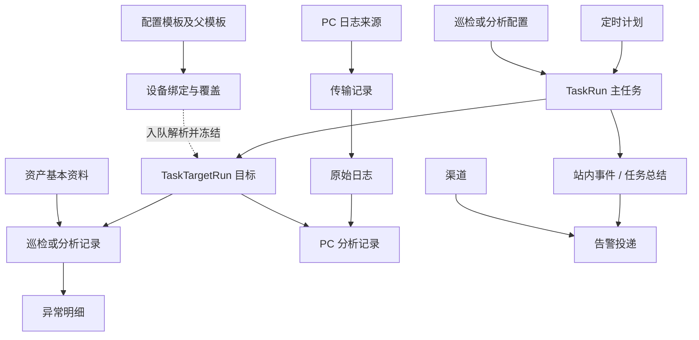

# 架构与数据库结构

[返回项目首页](../README.md#架构与技术栈)

## 数据流与事务边界

1. 管理员提交表单，后端检查权限、CSRF、设备类型、参数和版本；保存配置后按本次所选设备/项目生成任务快照。
2. `Schedule` 到期时由 Worker 创建 `TaskRun` 和 `TaskTargetRun`；手动任务使用同一队列。没有 Worker 时，网页仍可访问，但定时任务不会入队、后台操作不会执行。
3. Worker 短事务领取任务并续租，在事务外完成 SSH、SNMP、HTTP、LDAP、SMB/FTP 请求及耗时解析，最后重新检查租约/配置并短事务保存。
4. 设备巡检保存动态记录和异常；可采集的硬件资料按成功字段回填资产，失败项不清空旧资料。PC 先保存日志证据，再创建分析子任务；人员同步先获取完整预览，再事务应用。
5. 逐目标生成站内异常/恢复记录。整批任务终结且目标告警处理完成后，每渠道创建一条总结投递；网络发送在事务外完成，回写时校验投递租约。

**三种状态需要分开看**：任务执行状态（等待/运行/成功/部分成功/失败/取消）、所选项目的业务健康状态、消息投递状态。任务执行成功仍可能有 CPU 超限等业务异常；信息不足不代表设备故障；通知失败也不抹掉已保存的巡检结果。

数据库中的任务快照记录“入队时的范围和规则”，业务记录保存“当时的证据和结论”。新配置通常只影响新任务；历史结果不自动重算。人员/门禁/域控等外部数据操作还会核验实时配置，配置变更后拒绝应用旧结果。

## 数据库模型与关系

以 [模型定义](../net/models) 和 [迁移文件](../net/migrations) 为结构依据。下表是业务表索引，不是要求手动执行的建表 SQL。实际数据库是否已应用全部迁移，应运行 `python manage.py showmigrations net` 核实。

| 业务 | 模型及实际表名 | 关键字段与关系 |
| --- | --- | --- |
| 登录与授权 | Django `auth_user`、`auth_group`、`auth_permission` 及关系表 | 登录账号、staff/超级用户标记、后台模型权限；与业务人员独立 |
| 会话与迁移 | `django_session`、`django_migrations`、`django_content_type`、`django_admin_log` | 登录会话、已应用迁移、模型类型和后台操作日志 |
| 人员 | `People` → `net_people` | 工号 `employee_id` 唯一；姓名、部门、手机号、在职状态；`sync_source` 关联人员平台 |
| 人员平台 | `PeopleSyncSource` → `net_peoplesyncsource` | 唯一 `source_key`、凭据、根部门、启用状态；配置更新/连接测试/最近同步时间分别记录 |
| PC 台账 | `Computer` → `net_computer` | `computer_name` 唯一，保存基本资料和最近采集到的硬件信息 |
| 网络台账 | `Network_Device` → `net_network_device` | IP 唯一，厂商/类型、SSH/SNMP 连接参数和硬件资料 |
| 服务器台账 | `Server` → `net_server` | IP 唯一，Linux/Windows 类型、SSH 或 HTTP 参数、系统和硬件资料 |
| 安防台账 | `SecurityDevice` → `net_securitydevice` | IP 唯一，摄像头/录像机/门禁类型、厂商和连接参数 |
| 配置模板 | `DeviceCollectionTemplate` → `net_devicecollectiontemplate` | `kind + vendor + subtype + version_match` 唯一；`parent` 显式继承；`settings` 保存项目方法、命令、解析和报警规则 |
| 设备模板绑定 | `DeviceCollectionBinding` → `net_devicecollectionbinding` | `kind + target_id` 唯一；关联指定模板，保存 `overrides` 及加密协议凭据 |
| 巡检配置 | `InspectionProfile` → `net_inspectionprofile` | 设备类别、所选项目、目标选择器、超时/并发等；同类别配置名称唯一 |
| PC 分析配置 | `ComputerAnalysisProfile` → `net_computeranalysisprofile` | 唯一名称、人员/日志匹配模式、分析项目、软件规则和阈值 |
| 定时计划 | `Schedule` → `net_schedule` | 每行只关联一种巡检/PC 分析/人员来源/域控配置；间隔或每日时间、启用、下次执行、最近入队、最近调度尝试/状态/原因 |
| 主任务 | `TaskRun` → `net_taskrun` | 类型/来源、配置关联、规则/参数/目标快照、进度计数、租约/尝试次数、活动范围键 |
| 目标任务 | `TaskTargetRun` → `net_tasktargetrun` | 关联主任务；`task + target_type + target_id` 唯一；目标快照、执行状态、结果引用、告警处理状态、PC 分析交接子任务 |
| PC 日志来源 | `PCLogSourceConfig` → `net_pclogsourceconfig`；`PCLogSourceCredential` → `net_pclogsourcecredential` | 单一共享来源及目录、协议设置；凭据一对一独立加密保存 |
| PC 传输与日志 | `ComputerLogTransfer` → `net_computerlogtransfer`；`ComputerLogFile` → `net_computerlogfile` | 传输关联来源、目标和日志；日志关联 PC，保存内容哈希、日期、路径、导入状态和原始 JSON |
| 旧日志归档关联 | `ComputerLogArchive` → `net_computerlogarchive` | 关联日志的历史归档信息，保留用于历史追溯 |
| PC 分析结果 | `ComputerAnalysis` → `net_computeranalysis` | 关联 PC、日志和可选的一对一目标任务；所选项目、详情、异常和报告查询字段 |
| 设备巡检结果 | `Network_Device_Inspection` / `Server_Inspection` / `Monitor_Inspection` → `net_network_device_inspection` / `net_server_inspection` / `net_monitor_inspection` | 分别关联设备、服务器、安防资产及可选的一对一目标任务；状态、详情和指标 |
| 异常明细 | `Error_Computer` / `Error_Network_Device` / `Error_Server` / `Error_Monitor` → 对应 `net_error_*` 表 | 分别关联所属分析/巡检记录；不与任务执行失败混为一张表 |
| 原始配置备份 | `DeviceConfigurationBackup` → `net_deviceconfigurationbackup` | `device_type + device_id + backup_date` 唯一；原文密文、SHA-256、大小、采集时间及目标任务引用 |
| AD 本地对象 | `Domain_Account` / `Domain_Computer` / `Domain_Group` → `net_domain_account` / `net_domain_computer` / `net_domain_group` | AD object GUID 唯一，保存账号、计算机、分组及 DN 等本地快照 |
| AD 配置与写操作 | `Domain_Controller_Config` / `DomainOperation` / `DomainOperationSecret` → `net_domain_controller_config` / `net_domainoperation` / `net_domainoperationsecret` | 目录连接设置；操作记录关联申请账号和任务；密码载荷单独加密存储 |
| 门禁平台与记录 | `AccessRecordSource` / `AccessRecord` → `net_accessrecordsource` / `net_accessrecord` | 来源可关联安防设备；平台游标、加密令牌；`source + source_event_id` 唯一，保存时间/人员/门点/方向/结果 |
| 项目等级 | `IssueSeverityPolicy` → `net_issueseveritypolicy` | 按项目保存等级覆盖；设备模板可进一步提供项目阈值和等级 |
| 告警配置 | `AlertChannel` / `AlertPolicy` / `AlertNotificationTemplate` → `net_alertchannel` / `net_alertpolicy` / `net_alertnotificationtemplate` | 渠道、默认/项目路由策略与任务总结样式；策略与渠道为多对多 |
| 告警状态与事件 | `AlertState` / `AlertEvent` → `net_alertstate` / `net_alertevent` | 按配置、目标和问题键追踪异常/恢复；事件关联任务/目标；每任务总结由唯一 `summary_task` 保证 |
| 告警投递与测试 | `AlertDelivery` / `AlertTestSend` → `net_alertdelivery` / `net_alerttestsend` | 事件与渠道组合唯一，保存尝试次数、租约、响应摘要；渠道测试另行记录 |

核心关系如下，图中省略了设备类型分表、可空的历史引用以及 Django 自带表：

**查询字段**：动态记录维护 `report_metrics`、`report_problem_types`、`report_severity`、`report_enrichment` 等报告字段，方便数据库分页、筛选和统计；修改原始详情的维护脚本还须同步更新这些字段。直接 SQL 或绕过保存逻辑的批量更新可能造成页面与证据不一致。

**关系字段与 JSON 的分工**：资产、任务、来源、时间、状态及常用查询字段使用关系字段和索引；异构回显、详情、规则和快照使用 JSON。`TaskTargetRun.result_snapshot` 的新版格式主要保存结果引用和摘要，详情从对应业务记录读取，不应把所有历史 JSON 载入内存再分页。`DeviceCollectionBinding.target_id`、备份的 `device_id`、任务的 `target_id` 是带类型的业务引用，并非每种资产表都有一个数据库外键；不要据此手工删除关联对象。

**去重与并发**：日志内容哈希和有效的每日 PC 日志标记用于避免重复导入；活动传输标记用于避免重复领取远程文件；任务 `active_scope_key` 唯一约束控制相同范围的活动任务，目标还有执行范围互斥。门禁用平台事件 ID 去重，配置备份按设备和日期去重，任务总结及渠道投递各自有唯一约束。它们分别解决不同边界，不能把一次失败重试简单替换为删除历史记录。

**MariaDB 特别说明**：模型声明的条件唯一约束不等于数据库一定直接支持。`0040_mariadb_active_target_scope` 为目标执行范围添加了生成列 `net_active_execution_scope` 和唯一索引 `net_target_active_scope_mysql`，补足 MariaDB/MySQL 上的对应约束；不要只因 `models.W036` 就认定没有防重，也不要只屏蔽警告而忽略迁移。域分组 DN 的长字段唯一性会触发 `mysql.W003`，须在目标数据库核实索引能力和迁移结果，不能擅自截断 DN 或重置表。

维护时应备份数据库、环境配置、独立密钥和日志归档。`migrate` 更新结构；`makemigrations --check --dry-run` 只检查模型漂移；`showmigrations` 检查应用状态。不要把 ORM 模型自动序列化结果当成包含全部凭据及原始证据的完整备份。
